Lab 12
================
Mark Hebblewhite
2023-04-10

``` r
#function to install and load required packages
ipak <- function(pkg){
  new.pkg <- pkg[!(pkg %in% installed.packages()[, "Package"])]
  if (length(new.pkg)) 
    install.packages(new.pkg, dependencies = TRUE)
  sapply(pkg, require, character.only = TRUE)
}


packages <- c("unmarked", "reshape2", "dplyr", "ggplot2","AICcmodavg")

#run function to install packages
ipak(packages)
```

Follow this link:
[unmarked](https://cran.r-project.org/web/packages/unmarked/vignettes/unmarked.pdf)
for package vignette

############################################################ 

## 1.0 Frog Data Set Warm Up

``` r
pcru <- csvToUMF(system.file("csv", "frog2001pcru.csv", package = "unmarked"),long = TRUE, type = "unmarkedFrameOccu")
head(pcru)
```

    ## Data frame representation of unmarkedFrame object.
    ##    y.1 y.2 y.3 MinAfterSunset.1 MinAfterSunset.2 MinAfterSunset.3 Wind.1 Wind.2
    ## 1    3   3  NA               37               36               NA      2      0
    ## 2    3   0   2               47              -21               46      2      2
    ## 3    2   0   0               57              -11               56      2      2
    ## 4    1   0   2               67               -1               66      2      2
    ## 5    3   0   0               77                9               76      2      2
    ## 6    0   0   0               87               19               86      1      2
    ## 7    0   0   0               97               29               96      1      2
    ## 8    0   0   0              107               39              106      1      2
    ## 9    3   0   2              117               49              116      1      2
    ## 10   2   0   0              127               59              126      1      2
    ##    Wind.3 Sky.1 Sky.2 Sky.3 Temperature.1 Temperature.2 Temperature.3
    ## 1      NA     2     0    NA          12.2          19.4            NA
    ## 2       0     2     1     0          12.2          16.1          19.4
    ## 3       0     2     1     0          11.7          16.1          19.4
    ## 4       0     2     1     0          11.7          16.1          19.4
    ## 5       0     2     1     0          11.7          16.1          19.4
    ## 6       0     2     1     0          10.6          15.0          19.4
    ## 7       0     2     1     0          10.6          15.6          19.4
    ## 8       0     2     1     0          10.0          15.6          18.3
    ## 9       0     2     1     0          10.0          15.0          19.4
    ## 10      0     2     1     0           9.4          15.0          18.3
    ##    JulianDate.1 JulianDate.2 JulianDate.3
    ## 1            89          159           NA
    ## 2            89          129          159
    ## 3            89          129          159
    ## 4            89          129          159
    ## 5            89          129          159
    ## 6            89          129          159
    ## 7            89          129          159
    ## 8            89          129          159
    ## 9            89          129          159
    ## 10           89          129          159

``` r
summary(pcru)
```

    ## unmarkedFrame Object
    ## 
    ## 130 sites
    ## Maximum number of observations per site: 3 
    ## Mean number of observations per site: 2.59 
    ## Sites with at least one detection: 96 
    ## 
    ## Tabulation of y observations:
    ##    0    1    2    3 <NA> 
    ##  197   25   28   87   53 
    ## 
    ## Observation-level covariates:
    ##  MinAfterSunset        Wind             Sky          Temperature   
    ##  Min.   :-21.00   Min.   :0.0000   Min.   :0.0000   Min.   : 4.00  
    ##  1st Qu.: 66.00   1st Qu.:0.0000   1st Qu.:0.0000   1st Qu.:13.00  
    ##  Median : 97.00   Median :1.0000   Median :0.0000   Median :17.50  
    ##  Mean   : 97.57   Mean   :0.8813   Mean   :0.4837   Mean   :16.61  
    ##  3rd Qu.:126.00   3rd Qu.:2.0000   3rd Qu.:1.0000   3rd Qu.:20.60  
    ##  Max.   :228.00   Max.   :3.0000   Max.   :5.0000   Max.   :28.00  
    ##  NA's   :53       NA's   :53       NA's   :53       NA's   :53     
    ##    JulianDate   
    ##  Min.   : 72.0  
    ##  1st Qu.: 95.0  
    ##  Median :123.0  
    ##  Mean   :127.4  
    ##  3rd Qu.:159.0  
    ##  Max.   :179.0  
    ##  NA's   :53

There are 130 sites: - Maximum number of observations per site: 3 - Mean
number of observations per site: 2.59 - Sites with at least one
detection: 96

``` r
# Scale
obsCovs(pcru) <- scale(obsCovs(pcru))
```

### Fit occupancy models using occu function

``` r
# model 1: p(.)psi(.)
ex_mod_p1 <- occu(~ 1 ~ 1, data = pcru)
```

    ## Warning in truncateToBinary(designMats$y): Some observations were > 1.  These
    ## were truncated to 1.

``` r
ex_mod_p1
```

    ## 
    ## Call:
    ## occu(formula = ~1 ~ 1, data = pcru)
    ## 
    ## Occupancy:
    ##  Estimate   SE    z P(>|z|)
    ##      2.95 1.44 2.05    0.04
    ## 
    ## Detection:
    ##  Estimate   SE     z P(>|z|)
    ##    -0.249 0.17 -1.47   0.142
    ## 
    ## AIC: 461.0042

``` r
# model 2: p(MinAfterSunset,Temperature)psi(.)
ex_mod_p2 <- occu(~ MinAfterSunset + Temperature ~ 1, data = pcru)
```

    ## Warning in truncateToBinary(designMats$y): Some observations were > 1.  These
    ## were truncated to 1.

``` r
ex_mod_p2
```

    ## 
    ## Call:
    ## occu(formula = ~MinAfterSunset + Temperature ~ 1, data = pcru)
    ## 
    ## Occupancy:
    ##  Estimate    SE    z  P(>|z|)
    ##      1.54 0.292 5.26 1.42e-07
    ## 
    ## Detection:
    ##                Estimate    SE      z  P(>|z|)
    ## (Intercept)      0.2098 0.206  1.017 3.09e-01
    ## MinAfterSunset  -0.0855 0.160 -0.536 5.92e-01
    ## Temperature     -1.8936 0.291 -6.508 7.60e-11
    ## 
    ## AIC: 356.7591

### Visualize parameters

Variables can be back-transformed to the unconstrained scale using
`backTransform` (Standard errors are computed using the delta method.)

``` r
backTransform(ex_mod_p1, "state")
```

    ## Backtransformed linear combination(s) of Occupancy estimate(s)
    ## 
    ##  Estimate     SE LinComb (Intercept)
    ##      0.95 0.0678    2.95           1
    ## 
    ## Transformation: logistic

``` r
backTransform(ex_mod_p1, "det")
```

    ## Backtransformed linear combination(s) of Detection estimate(s)
    ## 
    ##  Estimate     SE LinComb (Intercept)
    ##     0.438 0.0417  -0.249           1
    ## 
    ## Transformation: logistic

``` r
backTransform(ex_mod_p2, "state")
```

    ## Backtransformed linear combination(s) of Occupancy estimate(s)
    ## 
    ##  Estimate     SE LinComb (Intercept)
    ##     0.823 0.0425    1.54           1
    ## 
    ## Transformation: logistic

Because the detection component was modeled with covariates, covariate
coefficients must be specified to back-transform. Here, we request the
probability of detection given a site is occupied and all covariates are
set to 0.

``` r
backTransform(linearComb(ex_mod_p2, coefficients = c(0, 0, -1), type = "det"))
```

    ## Backtransformed linear combination(s) of Detection estimate(s)
    ## 
    ##  Estimate     SE LinComb (Intercept) MinAfterSunset Temperature
    ##     0.869 0.0331    1.89           0              0          -1
    ## 
    ## Transformation: logistic

Next, we remind ourselves of the data to create predictions for specific
ranges of values

``` r
head(getData(ex_mod_p2))
```

    ## Data frame representation of unmarkedFrame object.
    ##    y.1 y.2 y.3 MinAfterSunset.1 MinAfterSunset.2 MinAfterSunset.3    Wind.1
    ## 1    3   3  NA      -1.33951098        -1.361627               NA 1.1586013
    ## 2    3   0   2      -1.11834827        -2.622255      -1.14046454 1.1586013
    ## 3    2   0   0      -0.89718557        -2.401092      -0.91930184 1.1586013
    ## 4    1   0   2      -0.67602286        -2.179929      -0.69813913 1.1586013
    ## 5    3   0   0      -0.45486015        -1.958767      -0.47697642 1.1586013
    ## 6    0   0   0      -0.23369745        -1.737604      -0.25581372 0.1229285
    ## 7    0   0   0      -0.01253474        -1.516441      -0.03465101 0.1229285
    ## 8    0   0   0       0.20862797        -1.295278       0.18651169 0.1229285
    ## 9    3   0   2       0.42979067        -1.074116       0.40767440 0.1229285
    ## 10   2   0   0       0.65095338        -0.852953       0.62883711 0.1229285
    ##        Wind.2     Wind.3    Sky.1      Sky.2      Sky.3 Temperature.1
    ## 1  -0.9127442         NA 1.678643 -0.5354576         NA    -0.7788286
    ## 2   1.1586013 -0.9127442 1.678643  0.5715928 -0.5354576    -0.7788286
    ## 3   1.1586013 -0.9127442 1.678643  0.5715928 -0.5354576    -0.8671888
    ## 4   1.1586013 -0.9127442 1.678643  0.5715928 -0.5354576    -0.8671888
    ## 5   1.1586013 -0.9127442 1.678643  0.5715928 -0.5354576    -0.8671888
    ## 6   1.1586013 -0.9127442 1.678643  0.5715928 -0.5354576    -1.0615814
    ## 7   1.1586013 -0.9127442 1.678643  0.5715928 -0.5354576    -1.0615814
    ## 8   1.1586013 -0.9127442 1.678643  0.5715928 -0.5354576    -1.1676136
    ## 9   1.1586013 -0.9127442 1.678643  0.5715928 -0.5354576    -1.1676136
    ## 10  1.1586013 -0.9127442 1.678643  0.5715928 -0.5354576    -1.2736459
    ##    Temperature.2 Temperature.3 JulianDate.1 JulianDate.2 JulianDate.3
    ## 1     0.49355877            NA    -1.205523   0.99286026           NA
    ## 2    -0.08961878     0.4935588    -1.205523   0.05069607    0.9928603
    ## 3    -0.08961878     0.4935588    -1.205523   0.05069607    0.9928603
    ## 4    -0.08961878     0.4935588    -1.205523   0.05069607    0.9928603
    ## 5    -0.08961878     0.4935588    -1.205523   0.05069607    0.9928603
    ## 6    -0.28401129     0.4935588    -1.205523   0.05069607    0.9928603
    ## 7    -0.17797901     0.4935588    -1.205523   0.05069607    0.9928603
    ## 8    -0.17797901     0.2991663    -1.205523   0.05069607    0.9928603
    ## 9    -0.28401129     0.4935588    -1.205523   0.05069607    0.9928603
    ## 10   -0.28401129     0.2991663    -1.205523   0.05069607    0.9928603

``` r
newData <- data.frame(MinAfterSunset = 0, Temperature = -2:2)
head(newData)
```

    ##   MinAfterSunset Temperature
    ## 1              0          -2
    ## 2              0          -1
    ## 3              0           0
    ## 4              0           1
    ## 5              0           2

``` r
predict(ex_mod_p2, type = "det", newdata = newData, appendData = TRUE)
```

    ##    Predicted         SE     lower      upper MinAfterSunset Temperature
    ## 1 0.98196076 0.01266193 0.9306044 0.99549474              0          -2
    ## 2 0.89123189 0.04248804 0.7763166 0.95084836              0          -1
    ## 3 0.55225129 0.05102660 0.4514814 0.64890493              0           0
    ## 4 0.15658708 0.03298276 0.1021713 0.23248007              0           1
    ## 5 0.02718682 0.01326263 0.0103505 0.06948653              0           2

``` r
predicted.data <- predict(ex_mod_p2, type = "det", newdata = newData, appendData = TRUE)
```

Rough plot of predicted probability of Occupancy as a function of
Temperature

``` r
ggplot(predicted.data, aes(Temperature, Predicted)) + stat_smooth(method="glm", method.args = list(family="binomial"), level = 0.5)
```

    ## `geom_smooth()` using formula = 'y ~ x'

    ## Warning in eval(family$initialize): non-integer #successes in a binomial glm!

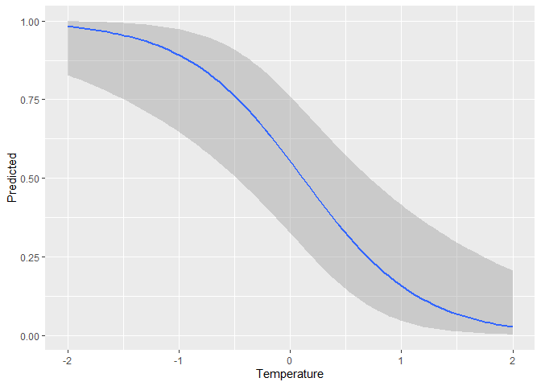<!-- -->

### Model Selection

First, Organize models into a list

``` r
fit.mlist <-fitList(fits=list('p.psi' = ex_mod_p1,'pMinAfterSunset_Temp_psi' = ex_mod_p2))
```

Then, display the comparison using the unmarked function “modSel”

``` r
modSel(fit.mlist, nullmod = "p.psi")
```

    ##                          nPars    AIC  delta   AICwt cumltvWt  Rsq
    ## pMinAfterSunset_Temp_psi     4 356.76   0.00 1.0e+00     1.00 0.58
    ## p.psi                        2 461.00 104.25 2.3e-23     1.00 0.00

The next two unmarked functions are for model averaging

### Model averaging basics

``` r
coef(fit.mlist)
```

    ##                          psi(Int)     p(Int) p(MinAfterSunset) p(Temperature)
    ## p.psi                    2.952089 -0.2490076                NA             NA
    ## pMinAfterSunset_Temp_psi 1.537304  0.2097710       -0.08554601      -1.893615

``` r
SE(fit.mlist)
```

    ##                           psi(Int)    p(Int) p(MinAfterSunset) p(Temperature)
    ## p.psi                    1.4376796 0.1695313                NA             NA
    ## pMinAfterSunset_Temp_psi 0.2921265 0.2063600         0.1597061      0.2909565

``` r
frogPsi_m2 <-predict(fit.mlist, type="state") # occupancy
mean(frogPsi_m2$Predicted)
```

    ## [1] 0.8230724

So how many sites predicted to be occupied? Recall there were 130 sites,
and 96 minimum detections

``` r
Naive = 96
Psi = 130*mean(frogPsi_m2$Predicted)
Psi - Naive
```

    ## [1] 10.99942

We predicted 10.99 more sites would have frogs than detected.

### Detection Probability

``` r
frogP_m2 <-predict(fit.mlist, type="det") # detection probability
hist(frogP_m2$Predicted)
```

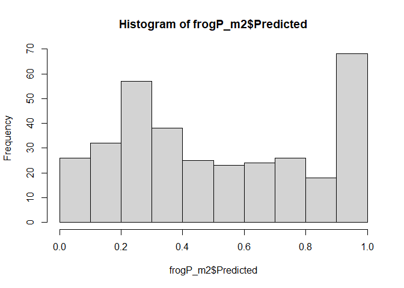<!-- -->

``` r
summary(frogP_m2)
```

    ##    Predicted             SE              lower             upper        
    ##  Min.   :0.02705   Min.   :0.00929   Min.   :0.01018   Min.   :0.06986  
    ##  1st Qu.:0.23288   1st Qu.:0.03195   1st Qu.:0.15991   1st Qu.:0.34165  
    ##  Median :0.47281   Median :0.04214   Median :0.35108   Median :0.59574  
    ##  Mean   :0.51166   Mean   :0.04488   Mean   :0.41853   Mean   :0.59704  
    ##  3rd Qu.:0.81690   3rd Qu.:0.05664   3rd Qu.:0.68586   3rd Qu.:0.90130  
    ##  Max.   :0.98798   Max.   :0.10510   Max.   :0.94665   Max.   :0.99738  
    ##  NA's   :53        NA's   :53        NA's   :53        NA's   :53

``` r
fitstats <- function(fm) {
  observed <- getY(fm@data)
  expected <- fitted(fm)
  resids <- residuals(fm)
  sse <- sum(resids^2)
  chisq <- sum((observed - expected)^2 / expected)
  freeTuke <- sum((sqrt(observed) - sqrt(expected))^2)
  out <- c(SSE=sse, Chisq=chisq, freemanTukey=freeTuke)
  return(out)
}
```

### Test of model fit: parametric bootstrap

``` r
load("Data/elkforheb.RData") ##loads functions chisq and Nocc used in parboot statistics

pcru.pb <- parboot(ex_mod_p2, statistics = chisq, nsim = 50)
pcru.pb
```

    ## 
    ## Call: parboot(object = ex_mod_p2, nsim = 50, statistics = chisq)
    ## 
    ## Parametric Bootstrap Statistics:
    ##     t0 mean(t0 - t_B) StdDev(t0 - t_B) Pr(t_B > t0)
    ## SSE 61          0.745             3.49        0.392
    ## 
    ## t_B quantiles:
    ##     0% 2.5% 25% 50% 75% 97.5% 100%
    ## SSE 53   54  58  60  63    66   68
    ## 
    ## t0 = Original statistic computed from data
    ## t_B = Vector of bootstrap samples

``` r
plot(pcru.pb)
```

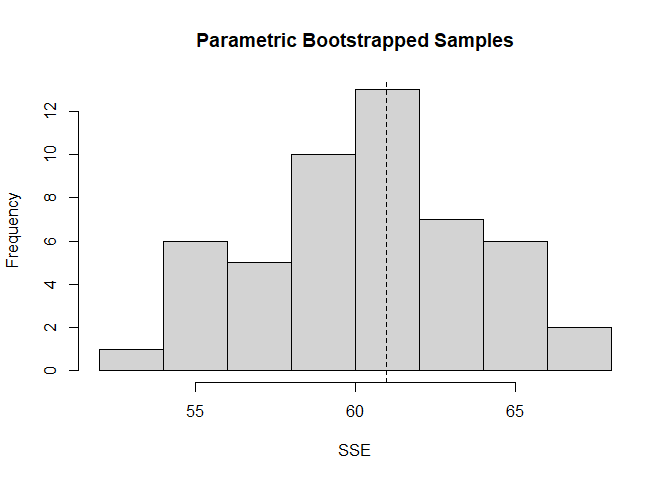<!-- -->

``` r
pcru.pb <- parboot(ex_mod_p2, Nocc, nsim = 50)
pcru.pb
```

    ## 
    ## Call: parboot(object = ex_mod_p2, statistic = Nocc, nsim = 50)
    ## 
    ## Parametric Bootstrap Statistics:
    ##    t0 mean(t0 - t_B) StdDev(t0 - t_B) Pr(t_B > t0)
    ## 1 107          -1.77             4.79        0.647
    ## 
    ## t_B quantiles:
    ##     0% 2.5% 25% 50% 75% 97.5% 100%
    ## t*1 99  100 107 109 112   119  119
    ## 
    ## t0 = Original statistic computed from data
    ## t_B = Vector of bootstrap samples

``` r
plot(pcru.pb)
abline(v=96, col="red")
```

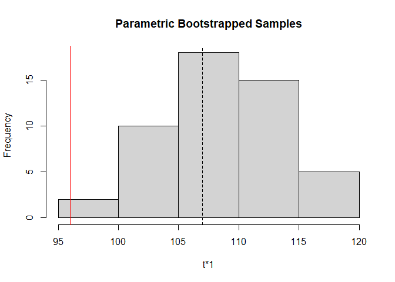<!-- -->

## 2. Occupancy Data - Elk

We will use the elk data loaded in the previous step
`load("Data/elkforheb.RData")`.

``` r
#load("Data/elkforheb.RData") 
ls()
```

    ##  [1] "chisq"          "convert"        "count2occu"     "covar"         
    ##  [5] "ex_mod_p1"      "ex_mod_p2"      "fit.mlist"      "fitstats"      
    ##  [9] "frogP_m2"       "frogPsi_m2"     "ifrm"           "ipak"          
    ## [13] "na.01"          "na01.fnc"       "na01.fnc2"      "Naive"         
    ## [17] "newData"        "Nocc"           "packages"       "panel.cor"     
    ## [21] "pcru"           "pcru.pb"        "predicted.data" "Psi"           
    ## [25] "sp"             "ydata"

``` r
str(ydata)
```

    ## 'data.frame':    698 obs. of  185 variables:
    ##  $ location   : Factor w/ 698 levels "1a bvp fireside 593655 5669661",..: 1 2 3 4 5 6 7 8 9 10 ...
    ##  $ X2014.05.01: num  NA NA NA NA NA NA NA NA NA NA ...
    ##  $ X2014.05.02: num  NA NA NA NA NA NA NA NA NA NA ...
    ##  $ X2014.05.03: num  NA NA NA NA NA NA NA NA NA NA ...
    ##  $ X2014.05.04: num  NA NA NA NA NA NA NA NA NA NA ...
    ##  $ X2014.05.05: int  NA NA NA NA NA NA NA NA NA NA ...
    ##  $ X2014.05.06: num  NA NA NA NA NA NA NA NA NA NA ...
    ##  $ X2014.05.07: num  NA NA NA NA NA NA NA NA NA NA ...
    ##  $ X2014.05.08: int  0 0 NA NA NA NA NA 0 NA NA ...
    ##  $ X2014.05.09: num  0 0 NA NA NA NA NA 0 NA NA ...
    ##  $ X2014.05.10: num  0 0 NA NA NA NA NA 0 NA NA ...
    ##  $ X2014.05.11: num  0 0 NA NA NA NA NA 0 NA NA ...
    ##  $ X2014.05.12: num  0 0 NA NA NA NA NA 0 NA NA ...
    ##  $ X2014.05.13: num  0 0 NA NA NA NA NA 0 NA NA ...
    ##  $ X2014.05.14: num  0 0 NA NA NA NA NA 0 NA NA ...
    ##  $ X2014.05.15: num  0 0 NA NA NA NA NA 0 NA NA ...
    ##  $ X2014.05.16: num  0 0 NA NA NA NA NA 0 NA NA ...
    ##  $ X2014.05.17: num  0 0 NA NA NA NA NA 0 NA NA ...
    ##  $ X2014.05.18: num  0 0 NA NA NA NA NA 0 NA NA ...
    ##  $ X2014.05.19: num  0 0 NA NA NA NA NA 0 NA NA ...
    ##  $ X2014.05.20: num  0 0 NA NA NA NA NA 0 NA NA ...
    ##  $ X2014.05.21: num  0 0 NA NA NA NA NA 0 NA NA ...
    ##  $ X2014.05.22: num  0 0 NA NA NA NA NA 0 NA NA ...
    ##  $ X2014.05.23: num  0 0 NA NA NA NA NA 0 NA NA ...
    ##  $ X2014.05.24: num  0 0 NA NA NA NA NA 0 NA NA ...
    ##  $ X2014.05.25: num  0 0 NA NA NA NA NA 0 NA NA ...
    ##  $ X2014.05.26: num  0 0 NA NA NA NA NA 0 NA NA ...
    ##  $ X2014.05.27: num  0 0 NA NA NA NA NA 0 NA NA ...
    ##  $ X2014.05.28: num  0 0 NA NA NA NA NA 0 NA NA ...
    ##  $ X2014.05.29: num  0 0 NA NA NA 0 0 0 NA NA ...
    ##  $ X2014.05.30: num  0 0 0 0 NA 0 0 0 NA NA ...
    ##  $ X2014.05.31: num  0 0 0 0 1 0 0 0 NA NA ...
    ##  $ X2014.06.01: num  0 0 0 0 1 0 0 0 NA NA ...
    ##  $ X2014.06.02: num  0 0 0 1 1 1 0 0 NA NA ...
    ##  $ X2014.06.03: num  0 0 0 0 1 0 0 0 NA NA ...
    ##  $ X2014.06.04: num  0 0 0 1 1 1 0 1 0 0 ...
    ##  $ X2014.06.05: num  0 0 0 1 1 0 0 0 0 0 ...
    ##  $ X2014.06.06: num  0 0 0 1 0 0 0 0 0 0 ...
    ##  $ X2014.06.07: num  0 0 0 0 1 0 0 0 0 0 ...
    ##  $ X2014.06.08: num  NA 0 0 0 1 1 0 1 0 0 ...
    ##  $ X2014.06.09: num  NA NA 0 1 1 0 0 0 0 0 ...
    ##  $ X2014.06.10: num  NA NA 0 0 0 0 0 0 0 1 ...
    ##  $ X2014.06.11: num  NA NA 0 0 0 1 0 0 0 0 ...
    ##  $ X2014.06.12: num  NA NA 1 0 1 0 0 0 0 0 ...
    ##  $ X2014.06.13: num  NA NA 0 0 0 0 0 0 0 0 ...
    ##  $ X2014.06.14: num  NA NA 0 0 0 0 0 0 0 0 ...
    ##  $ X2014.06.15: num  NA NA 0 0 0 0 0 0 0 0 ...
    ##  $ X2014.06.16: num  NA NA 0 0 0 0 0 0 0 0 ...
    ##  $ X2014.06.17: num  NA NA 0 0 1 0 0 0 0 0 ...
    ##  $ X2014.06.18: num  NA NA 1 0 0 0 0 0 0 0 ...
    ##  $ X2014.06.19: num  NA NA 0 0 1 0 0 0 0 1 ...
    ##  $ X2014.06.20: num  NA NA 0 0 0 0 0 0 0 0 ...
    ##  $ X2014.06.21: num  NA NA 0 0 0 1 NA 0 0 0 ...
    ##  $ X2014.06.22: num  NA NA 0 0 0 0 NA 0 0 0 ...
    ##  $ X2014.06.23: num  NA NA 0 0 0 0 NA 0 0 0 ...
    ##  $ X2014.06.24: num  NA NA 0 0 0 0 NA 0 0 0 ...
    ##  $ X2014.06.25: num  NA NA 0 0 0 0 NA 0 0 0 ...
    ##  $ X2014.06.26: num  NA NA 0 0 0 0 NA 0 0 0 ...
    ##  $ X2014.06.27: num  NA NA 0 0 1 0 NA 0 0 0 ...
    ##  $ X2014.06.28: num  NA NA 0 0 1 0 NA 0 0 0 ...
    ##  $ X2014.06.29: num  NA NA 0 0 0 0 NA 0 0 0 ...
    ##  $ X2014.06.30: num  NA NA 0 0 0 0 NA 0 0 0 ...
    ##  $ X2014.07.01: num  NA NA 0 0 0 0 NA 0 0 0 ...
    ##  $ X2014.07.02: num  NA NA 1 0 0 0 NA 0 0 0 ...
    ##  $ X2014.07.03: num  NA NA 0 0 0 0 NA 0 0 1 ...
    ##  $ X2014.07.04: num  NA NA 0 0 0 0 NA 0 0 0 ...
    ##  $ X2014.07.05: num  NA NA 0 0 1 0 NA 0 0 0 ...
    ##  $ X2014.07.06: num  NA NA 0 0 1 0 NA 0 0 0 ...
    ##  $ X2014.07.07: num  NA NA 0 0 0 0 NA 1 0 0 ...
    ##  $ X2014.07.08: num  NA NA 0 0 1 0 NA 0 0 0 ...
    ##  $ X2014.07.09: num  NA NA 1 0 0 0 NA 0 0 0 ...
    ##  $ X2014.07.10: num  NA NA 0 0 0 0 NA 0 0 0 ...
    ##  $ X2014.07.11: num  NA NA 0 0 0 0 NA 0 0 0 ...
    ##  $ X2014.07.12: num  NA NA 0 0 0 0 0 0 0 0 ...
    ##  $ X2014.07.13: num  NA NA 0 0 0 0 0 0 0 0 ...
    ##  $ X2014.07.14: num  NA NA 0 0 0 0 0 0 0 0 ...
    ##  $ X2014.07.15: num  NA NA 1 0 0 0 0 NA 0 1 ...
    ##  $ X2014.07.16: num  NA NA 0 0 0 NA 0 NA 0 0 ...
    ##  $ X2014.07.17: num  NA NA 0 0 0 NA 0 NA 0 0 ...
    ##  $ X2014.07.18: num  NA NA 0 0 0 NA 0 NA 0 0 ...
    ##  $ X2014.07.19: num  NA NA 0 0 0 NA 0 NA 0 0 ...
    ##  $ X2014.07.20: num  NA NA 0 0 0 NA 0 NA 0 1 ...
    ##  $ X2014.07.21: num  NA NA 0 0 0 NA 0 NA 0 0 ...
    ##  $ X2014.07.22: num  NA NA 0 0 0 NA 0 NA 0 0 ...
    ##  $ X2014.07.23: num  NA NA 0 0 0 NA 0 NA 0 0 ...
    ##  $ X2014.07.24: num  NA NA 0 0 0 NA NA NA 0 0 ...
    ##  $ X2014.07.25: num  NA NA 0 0 0 NA NA NA 0 0 ...
    ##  $ X2014.07.26: num  NA NA 0 0 0 NA NA NA 0 0 ...
    ##  $ X2014.07.27: num  NA NA 0 0 0 NA NA NA 0 0 ...
    ##  $ X2014.07.28: num  NA NA 0 0 0 NA NA NA 0 0 ...
    ##  $ X2014.07.29: num  NA NA 0 0 1 NA NA NA 0 0 ...
    ##  $ X2014.07.30: num  NA NA 0 0 1 NA NA NA 0 0 ...
    ##  $ X2014.07.31: num  NA NA 0 0 0 NA NA NA 0 0 ...
    ##  $ X2014.08.01: num  NA NA 0 0 0 NA NA NA 0 0 ...
    ##  $ X2014.08.02: num  NA NA 0 0 1 NA NA NA 0 0 ...
    ##  $ X2014.08.03: num  NA NA 0 0 0 NA NA NA 0 0 ...
    ##  $ X2014.08.04: num  NA NA NA NA NA NA NA NA NA 0 ...
    ##  $ X2014.08.05: num  NA NA NA NA NA NA NA NA NA 0 ...
    ##  $ X2014.08.06: num  NA NA NA NA NA NA NA NA NA NA ...
    ##   [list output truncated]

``` r
str(sp)
```

    ##  chr "elk"

``` r
str(covar)
```

    ## 'data.frame':    698 obs. of  78 variables:
    ##  $ order              : int  1 2 3 4 5 6 7 8 9 10 ...
    ##  $ location           : Factor w/ 698 levels "1a bvp fireside 593655 5669661",..: 1 2 3 4 5 6 7 8 9 10 ...
    ##  $ utm_zone           : int  11 11 11 11 11 11 11 11 11 11 ...
    ##  $ easting            : int  593655 593661 581622 584926 584830 585153 583958 584589 584385 582997 ...
    ##  $ northing           : int  5669661 5669691 5676626 5676065 5675685 5675213 5676539 5675747 5676092 5675600 ...
    ##  $ locationdescription: Factor w/ 462 levels ""," East side of Badger Pass on south side of trail near treeline.",..: 160 159 449 196 450 197 420 100 38 390 ...
    ##  $ rubtree_lick       : Factor w/ 8 levels "","Communication Tree",..: NA NA 6 5 5 5 5 NA 5 5 ...
    ##  $ commentslocation   : Factor w/ 163 levels "","\"lower Moosehorn\"",..: 30 31 NA NA NA NA NA 130 85 NA ...
    ##  $ project            : Factor w/ 21 levels "1A Closure Effectiveness Monitoring",..: 9 1 1 1 1 1 1 1 1 1 ...
    ##  $ park               : Factor w/ 12 levels "BNP","crowsnest",..: 1 1 1 1 1 1 1 1 1 1 ...
    ##  $ lure               : int  0 0 0 0 0 0 0 0 0 0 ...
    ##  $ trailtype          : Factor w/ 28 levels "","atv","cutline-trail",..: 15 15 20 25 25 15 15 15 25 25 ...
    ##  $ trailtype2         : Factor w/ 3 levels "human","linear",..: 2 2 2 3 3 2 2 2 3 3 ...
    ##  $ camera             : Factor w/ 3 levels "covert","flash",..: 1 1 1 1 1 1 1 1 1 1 ...
    ##  $ protected2         : Factor w/ 2 levels "protected","unprotected": 1 1 1 1 1 1 1 1 1 1 ...
    ##  $ protected3         : Factor w/ 3 levels "hunting","protected",..: 2 2 2 2 2 2 2 2 2 2 ...
    ##  $ dem90m             : num  1413 1413 1440 1428 1418 ...
    ##  $ slope90m           : num  9.77 9.77 0 1.81 3.12 ...
    ##  $ aspect90m          : num  189 189 0 193 227 ...
    ##  $ tpi20              : num  -107.3 -102.3 -55.1 -57.5 -48.1 ...
    ##  $ tpi100             : num  -253 -243 -184 -206 -202 ...
    ##  $ tpi500             : num  -436 -422 -503 -497 -520 ...
    ##  $ landcov_jw         : int  7 7 1 2 1 7 7 7 1 2 ...
    ##  $ d2road             : num  0 0 269 323 120 ...
    ##  $ d2rail             : num  108.2 134.2 42.4 823.8 456.9 ...
    ##  $ cc500              : num  40.2 40.2 39.9 40.1 40.5 ...
    ##  $ cc100              : num  45 45 53.5 44.1 45 ...
    ##  $ burns20            : num  0 0 0 0.165 0.136 ...
    ##  $ burns100           : num  0.057 0.057 0.0216 0.0932 0.0921 ...
    ##  $ burns500           : num  0.0261 0.0261 0.0222 0.0226 0.0223 ...
    ##  $ regen20            : num  0.04165 0.04165 0.00625 0.11912 0.12453 ...
    ##  $ regen100           : num  0.0443 0.0443 0.035 0.0411 0.0411 ...
    ##  $ regen500           : num  0.0518 0.0518 0.0503 0.0289 0.0299 ...
    ##  $ cuts20             : num  0 0 0 0 0 0 0 0 0 0 ...
    ##  $ cuts100            : num  0 0 0 0 0 0 0 0 0 0 ...
    ##  $ cuts500            : num  0 0 0 0 0 0 0 0 0 0 ...
    ##  $ NDVIAug500         : num  0.592 0.592 0.573 0.574 0.576 ...
    ##  $ NDVIAug100         : num  0.633 0.633 0.635 0.618 0.618 ...
    ##  $ NDVIAug20          : num  0.655 0.655 0.694 0.634 0.65 ...
    ##  $ NDVIJul500         : num  0.594 0.594 0.574 0.575 0.577 ...
    ##  $ NDVIJul100         : num  0.632 0.632 0.634 0.616 0.617 ...
    ##  $ NDVIJul20          : num  0.659 0.659 0.701 0.648 0.655 ...
    ##  $ dhicum20           : num  8.93 7.79 11.48 10.1 10.1 ...
    ##  $ dhicum100          : num  7.94 8.03 9.24 7.96 7.96 ...
    ##  $ dhicum500          : num  6.77 6.82 6.28 6.28 6.28 ...
    ##  $ dhimin20           : num  0.1143 0.0976 0.163 0.1319 0.1319 ...
    ##  $ dhimin100          : num  0.0992 0.0993 0.1101 0.0877 0.0877 ...
    ##  $ dhimin500          : num  0.07 0.0711 0.0549 0.0561 0.0561 ...
    ##  $ dhiseas20          : num  0.507 0.607 0.417 0.517 0.517 ...
    ##  $ dhiseas100         : num  0.649 0.644 0.634 0.755 0.755 ...
    ##  $ dhiseas500         : num  0.827 0.822 0.965 0.946 0.946 ...
    ##  $ ppltot             : int  0 0 14 4 28 226 135 61 4 4 ...
    ##  $ pplcat3a           : int  0 0 10 1 10 10 10 10 1 1 ...
    ##  $ pplcat3b           : int  0 0 1 1 1 100 100 1 1 1 ...
    ##  $ pplcat3c           : int  0 0 1 1 1 1 1 1 1 1 ...
    ##  $ pplcat5            : int  0 0 10 1 10 100 100 10 1 1 ...
    ##  $ motortot           : int  0 0 0 0 0 0 0 0 0 0 ...
    ##  $ motorcat3a         : int  0 0 0 0 0 0 0 0 0 0 ...
    ##  $ motorcat3b         : int  0 0 0 0 0 0 0 0 0 0 ...
    ##  $ motorcat3c         : int  0 0 0 0 0 0 0 0 0 0 ...
    ##  $ motorcat5          : int  0 0 0 0 0 0 0 0 0 0 ...
    ##  $ allhumantot        : int  0 0 14 4 28 226 135 61 4 4 ...
    ##  $ allhumancat3a      : int  0 0 10 1 10 10 10 10 1 1 ...
    ##  $ allhumancat3b      : int  0 0 1 1 1 100 100 1 1 1 ...
    ##  $ allhumancat3c      : int  0 0 1 1 1 1 1 1 1 1 ...
    ##  $ allhumancat5       : int  0 0 10 1 10 100 100 10 1 1 ...
    ##  $ pplcat2a           : int  0 0 1 1 1 1 1 1 1 1 ...
    ##  $ pplcat2b           : int  0 0 10 0 10 10 10 10 0 0 ...
    ##  $ pplcat2c           : int  0 0 0 0 0 100 100 0 0 0 ...
    ##  $ pplcat2d           : int  0 0 0 0 0 0 0 0 0 0 ...
    ##  $ motorcat2a         : int  0 0 0 0 0 0 0 0 0 0 ...
    ##  $ motorcat2b         : int  0 0 0 0 0 0 0 0 0 0 ...
    ##  $ motorcat2c         : int  0 0 0 0 0 0 0 0 0 0 ...
    ##  $ motorcat2d         : int  0 0 0 0 0 0 0 0 0 0 ...
    ##  $ allhumancat2a      : int  0 0 1 1 1 1 1 1 1 1 ...
    ##  $ allhumancat2b      : int  0 0 10 0 10 10 10 10 0 0 ...
    ##  $ allhumancat2c      : int  0 0 0 0 0 100 100 0 0 0 ...
    ##  $ allhumancat2d      : int  0 0 0 0 0 0 0 0 0 0 ...

``` r
ggplot(covar, aes(easting, northing)) + geom_point()
```

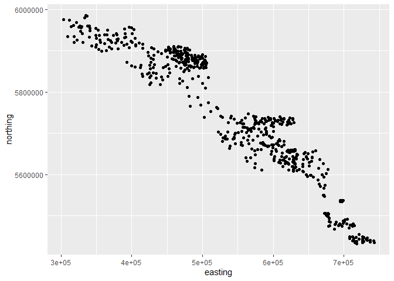<!-- -->

### Map data

1.  make covar a sp points object
2.  Import shapefiles
3.  Plot using shapefiles
4.  Plot using mapview.

### Scale numeric variables and set other variables to factors

``` r
new_covar <- covar %>%
  mutate(northness = cos(aspect90m)) %>%
  mutate(eastness = sin(aspect90m)) %>%
  rename(elev =dem90m) %>%
  mutate(elev2 = elev*elev) %>%
  mutate_if(is.integer, as.character) %>%
  mutate_if(is.character, as.factor) %>%
  mutate_if(is.numeric, scale)

sel_cov <- new_covar %>%
  dplyr::select('northness', 'eastness', 'slope' = 'slope90m', 'elev',
                'elev2', 'd2road', 'tpi20', 'tpi100', 'tpi500', 'cc500', 'cc100', 'burns20','burns100', 'burns500', 'regen20', 'regen100', 'regen500', 'cuts20','cuts100', 'cuts500', 'NDVIAug500', 'NDVIAug20', 'NDVIJul500', 'NDVIJul100','NDVIJul20', 'NDVIAug100', 'dhicum20', 'dhicum100', 'dhicum500', 'dhimin20','dhimin100', 'dhimin500', 'dhiseas20', 'dhiseas100', 'dhiseas500', 'lure','protected2', 'protected3', 'trailtype',  'camera','ppltot', 'pplcat3a', 'pplcat3b', 'pplcat3c', 'pplcat5','motortot', 'motorcat3a', 'motorcat3b', 'motorcat3c', 'motorcat5','allhumantot', 'allhumancat3a', 'allhumancat3b', 'allhumancat3c','allhumancat5', 'pplcat2a', 'pplcat2b', 'pplcat2c', 'pplcat2d', 'motorcat2a','motorcat2b', 'motorcat2c', 'motorcat2d', 'allhumancat2a', 'allhumancat2b','allhumancat2c', 'allhumancat2d')

elk_cov <- sel_cov %>%
  dplyr::select('elev', 'slope', 'cuts100', 'pplcat3a',  'lure', 'camera') %>%
  mutate_if(is.numeric, scale)
```

### Prep EH and unmarked data object

Convert to 7-day intervals

``` r
#str(ydata) ## Note there are both NAs and 0s
ydata7 <- convert(ydata, 7)
ydata7 <- count2occu(ydata7) # makes sure occupancy data, not count

# Generate data in unmarked foramt
umf <- unmarkedFrameOccu(y = ydata7[,-1], siteCovs = sel_cov) 
summary(umf)
```

    ## unmarkedFrame Object
    ## 
    ## 698 sites
    ## Maximum number of observations per site: 26 
    ## Mean number of observations per site: 15.73 
    ## Sites with at least one detection: 250 
    ## 
    ## Tabulation of y observations:
    ##    0    1 <NA> 
    ## 9946 1037 7165 
    ## 
    ## Site-level covariates:
    ##      northness.V1         eastness.V1           slope.V1      
    ##  Min.   :-1.3886074   Min.   :-1.4515928   Min.   :-1.188422  
    ##  1st Qu.:-0.9844046   1st Qu.:-1.0194632   1st Qu.:-0.731983  
    ##  Median : 0.0201622   Median :-0.0009630   Median :-0.325304  
    ##  Mean   : 0.0000000   Mean   : 0.0000000   Mean   : 0.000000  
    ##  3rd Qu.: 0.9844913   3rd Qu.: 1.0051851   3rd Qu.: 0.457491  
    ##  Max.   : 1.4116095   Max.   : 1.4027490   Max.   : 4.201904  
    ##                                                               
    ##        elev.V1            elev2.V1            d2road.V1     
    ##  Min.   :-2.055697   Min.   :-1.681317   Min.   :-0.657141  
    ##  1st Qu.:-0.746973   1st Qu.:-0.744901   1st Qu.:-0.632203  
    ##  Median :-0.194627   Median :-0.264329   Median :-0.509238  
    ##  Mean   : 0.000000   Mean   : 0.000000   Mean   : 0.000000  
    ##  3rd Qu.: 0.658677   3rd Qu.: 0.577700   3rd Qu.: 0.284053  
    ##  Max.   : 3.559822   Max.   : 4.344965   Max.   : 4.016117  
    ##                                                             
    ##       tpi20.V1            tpi100.V1           tpi500.V1     
    ##  Min.   :-3.499891   Min.   :-3.093437   Min.   :-2.197280  
    ##  1st Qu.:-0.631914   1st Qu.:-0.677113   1st Qu.:-0.819541  
    ##  Median : 0.104643   Median :-0.016621   Median :-0.077865  
    ##  Mean   : 0.000000   Mean   : 0.000000   Mean   : 0.000000  
    ##  3rd Qu.: 0.714565   3rd Qu.: 0.728437   3rd Qu.: 0.790775  
    ##  Max.   : 3.975207   Max.   : 3.604451   Max.   : 3.512964  
    ##                                                             
    ##        cc500.V1             cc100.V1           burns20.V1     
    ##  Min.   :-2.4597631   Min.   :-2.3241004   Min.   :-0.310668  
    ##  1st Qu.:-0.6825440   1st Qu.:-0.6986232   1st Qu.:-0.310668  
    ##  Median :-0.0506345   Median : 0.1095250   Median :-0.310668  
    ##  Mean   : 0.0000000   Mean   : 0.0000000   Mean   : 0.000000  
    ##  3rd Qu.: 0.6404739   3rd Qu.: 0.6303161   3rd Qu.:-0.310668  
    ##  Max.   : 2.3579251   Max.   : 2.2018771   Max.   : 8.144996  
    ##                                                               
    ##      burns100.V1         burns500.V1         regen20.V1     
    ##  Min.   :-0.382638   Min.   :-0.551662   Min.   :-0.487168  
    ##  1st Qu.:-0.382638   1st Qu.:-0.551662   1st Qu.:-0.487168  
    ##  Median :-0.382638   Median :-0.473974   Median :-0.487168  
    ##  Mean   : 0.000000   Mean   : 0.000000   Mean   : 0.000000  
    ##  3rd Qu.:-0.218294   3rd Qu.: 0.072498   3rd Qu.: 0.048362  
    ##  Max.   :10.094603   Max.   : 6.422277   Max.   : 7.782234  
    ##                                                             
    ##      regen100.V1         regen500.V1           cuts20.V1     
    ##  Min.   :-0.626765   Min.   :-0.9895854   Min.   :-0.348447  
    ##  1st Qu.:-0.626765   1st Qu.:-0.7946915   1st Qu.:-0.348447  
    ##  Median :-0.509249   Median :-0.3676959   Median :-0.348447  
    ##  Mean   : 0.000000   Mean   : 0.0000000   Mean   : 0.000000  
    ##  3rd Qu.: 0.218919   3rd Qu.: 0.6689357   3rd Qu.:-0.348447  
    ##  Max.   : 6.614073   Max.   : 2.9882534   Max.   : 6.932220  
    ##                                                              
    ##      cuts100.V1          cuts500.V1         NDVIAug500.V1   
    ##  Min.   :-0.394893   Min.   :-0.472558   Min.   :-3.388444  
    ##  1st Qu.:-0.394893   1st Qu.:-0.472558   1st Qu.:-0.491331  
    ##  Median :-0.394893   Median :-0.472138   Median : 0.095572  
    ##  Mean   : 0.000000   Mean   : 0.000000   Mean   : 0.000000  
    ##  3rd Qu.:-0.320969   3rd Qu.:-0.127665   3rd Qu.: 0.657161  
    ##  Max.   : 5.238712   Max.   : 3.790544   Max.   : 1.839171  
    ##                                                             
    ##     NDVIAug20.V1        NDVIJul500.V1       NDVIJul100.V1   
    ##  Min.   :-4.004621   Min.   :-3.241717   Min.   :-3.521479  
    ##  1st Qu.:-0.566044   1st Qu.:-0.582273   1st Qu.:-0.529114  
    ##  Median : 0.244914   Median : 0.073529   Median : 0.104215  
    ##  Mean   : 0.000000   Mean   : 0.000000   Mean   : 0.000000  
    ##  3rd Qu.: 0.664841   3rd Qu.: 0.801901   3rd Qu.: 0.740795  
    ##  Max.   : 1.583601   Max.   : 1.803222   Max.   : 1.687377  
    ##                                                             
    ##     NDVIJul20.V1        NDVIAug100.V1        dhicum20.V1     
    ##  Min.   :-3.849805   Min.   :-3.665736   Min.   :-2.3215625  
    ##  1st Qu.:-0.567316   1st Qu.:-0.540988   1st Qu.:-0.7038365  
    ##  Median : 0.215904   Median : 0.140823   Median : 0.1111551  
    ##  Mean   : 0.000000   Mean   : 0.000000   Mean   : 0.0000000  
    ##  3rd Qu.: 0.737408   3rd Qu.: 0.643154   3rd Qu.: 0.7298704  
    ##  Max.   : 1.585930   Max.   : 1.685819   Max.   : 2.1475192  
    ##                                                              
    ##      dhicum100.V1         dhicum500.V1         dhimin20.V1     
    ##  Min.   :-2.3096187   Min.   :-2.1757399   Min.   :-1.2679708  
    ##  1st Qu.:-0.7766456   1st Qu.:-0.6752310   1st Qu.:-0.8718069  
    ##  Median : 0.1017917   Median :-0.1128396   Median :-0.1124373  
    ##  Mean   : 0.0000000   Mean   : 0.0000000   Mean   : 0.0000000  
    ##  3rd Qu.: 0.6303698   3rd Qu.: 0.6032692   3rd Qu.: 0.5669002  
    ##  Max.   : 2.3071927   Max.   : 2.3211864   Max.   : 3.0295937  
    ##                                                                
    ##      dhimin100.V1         dhimin500.V1        dhiseas20.V1    
    ##  Min.   :-1.2782144   Min.   :-1.3219716   Min.   :-1.503050  
    ##  1st Qu.:-0.8570972   1st Qu.:-0.8003488   1st Qu.:-0.741386  
    ##  Median :-0.0469104   Median :-0.2200137   Median :-0.290136  
    ##  Mean   : 0.0000000   Mean   : 0.0000000   Mean   : 0.000000  
    ##  3rd Qu.: 0.5047850   3rd Qu.: 0.4025858   3rd Qu.: 0.564086  
    ##  Max.   : 3.0619782   Max.   : 2.8693326   Max.   : 4.609716  
    ##                                                               
    ##     dhiseas100.V1        dhiseas500.V1     lure          protected2 
    ##  Min.   :-1.5758117   Min.   :-1.7892504   0:596   protected  :422  
    ##  1st Qu.:-0.7330024   1st Qu.:-0.6783971   1:102   unprotected:276  
    ##  Median :-0.3167987   Median :-0.1843189                            
    ##  Mean   : 0.0000000   Mean   : 0.0000000                            
    ##  3rd Qu.: 0.6281711   3rd Qu.: 0.6732747                            
    ##  Max.   : 2.7918866   Max.   : 2.4857315                            
    ##                                                                     
    ##        protected3          trailtype       camera        ppltot    pplcat3a
    ##  hunting    :105   Human Trail  :171   covert :437   0      :187   0 :187  
    ##  protected  :317   Wildlife     :139   flash  :173   1      : 59   1 :276  
    ##  unprotected:276   cutline-trail: 79   unknown: 88   4      : 40   10:235  
    ##                                 : 53                 3      : 37           
    ##                    Road Bed     : 27                 5      : 37           
    ##                    (Other)      :169                 2      : 33           
    ##                    NA's         : 60                 (Other):305           
    ##  pplcat3b  pplcat3c   pplcat5       motortot   motorcat3a motorcat3b motorcat3c
    ##  0  :187   0   :187   0   :187   0      :548   0 :548     0  :548    0   :548  
    ##  1  :432   1   :501   1   :276   2      :  8   1 : 45     1  :103    1   :133  
    ##  100: 79   1000: 10   10  :156   3      :  8   10:105     100: 47    1000: 17  
    ##                       100 : 69   4      :  7                                   
    ##                       1000: 10   7      :  6                                   
    ##                                  1      :  4                                   
    ##                                  (Other):117                                   
    ##  motorcat5   allhumantot  allhumancat3a allhumancat3b allhumancat3c
    ##  0   :548   0      :182   0 :182        0  :182       0   :182     
    ##  1   : 45   1      : 50   1 :219        1  :390       1   :488     
    ##  10  : 58   2      : 30   10:297        100:126       1000: 28     
    ##  100 : 30   4      : 29                                            
    ##  1000: 17   3      : 26                                            
    ##             5      : 26                                            
    ##             (Other):355                                            
    ##  allhumancat5 pplcat2a pplcat2b pplcat2c  pplcat2d   motorcat2a motorcat2b
    ##  0   :182     0:187    0 :463   0  :619   0   :688   0:548      0 :593    
    ##  1   :219     1:511    10:235   100: 79   1000: 10   1:150      10:105    
    ##  10  :171                                                                 
    ##  100 : 98                                                                 
    ##  1000: 28                                                                 
    ##                                                                           
    ##                                                                           
    ##  motorcat2c motorcat2d allhumancat2a allhumancat2b allhumancat2c allhumancat2d
    ##  0  :651    0   :681   0:182         0 :401        0  :572       0   :670     
    ##  100: 47    1000: 17   1:516         10:297        100:126       1000: 28     
    ##                                                                               
    ##                                                                               
    ##                                                                               
    ##                                                                               
    ## 

``` r
summary(umf)
```

    ## unmarkedFrame Object
    ## 
    ## 698 sites
    ## Maximum number of observations per site: 26 
    ## Mean number of observations per site: 15.73 
    ## Sites with at least one detection: 250 
    ## 
    ## Tabulation of y observations:
    ##    0    1 <NA> 
    ## 9946 1037 7165 
    ## 
    ## Site-level covariates:
    ##      northness.V1         eastness.V1           slope.V1      
    ##  Min.   :-1.3886074   Min.   :-1.4515928   Min.   :-1.188422  
    ##  1st Qu.:-0.9844046   1st Qu.:-1.0194632   1st Qu.:-0.731983  
    ##  Median : 0.0201622   Median :-0.0009630   Median :-0.325304  
    ##  Mean   : 0.0000000   Mean   : 0.0000000   Mean   : 0.000000  
    ##  3rd Qu.: 0.9844913   3rd Qu.: 1.0051851   3rd Qu.: 0.457491  
    ##  Max.   : 1.4116095   Max.   : 1.4027490   Max.   : 4.201904  
    ##                                                               
    ##        elev.V1            elev2.V1            d2road.V1     
    ##  Min.   :-2.055697   Min.   :-1.681317   Min.   :-0.657141  
    ##  1st Qu.:-0.746973   1st Qu.:-0.744901   1st Qu.:-0.632203  
    ##  Median :-0.194627   Median :-0.264329   Median :-0.509238  
    ##  Mean   : 0.000000   Mean   : 0.000000   Mean   : 0.000000  
    ##  3rd Qu.: 0.658677   3rd Qu.: 0.577700   3rd Qu.: 0.284053  
    ##  Max.   : 3.559822   Max.   : 4.344965   Max.   : 4.016117  
    ##                                                             
    ##       tpi20.V1            tpi100.V1           tpi500.V1     
    ##  Min.   :-3.499891   Min.   :-3.093437   Min.   :-2.197280  
    ##  1st Qu.:-0.631914   1st Qu.:-0.677113   1st Qu.:-0.819541  
    ##  Median : 0.104643   Median :-0.016621   Median :-0.077865  
    ##  Mean   : 0.000000   Mean   : 0.000000   Mean   : 0.000000  
    ##  3rd Qu.: 0.714565   3rd Qu.: 0.728437   3rd Qu.: 0.790775  
    ##  Max.   : 3.975207   Max.   : 3.604451   Max.   : 3.512964  
    ##                                                             
    ##        cc500.V1             cc100.V1           burns20.V1     
    ##  Min.   :-2.4597631   Min.   :-2.3241004   Min.   :-0.310668  
    ##  1st Qu.:-0.6825440   1st Qu.:-0.6986232   1st Qu.:-0.310668  
    ##  Median :-0.0506345   Median : 0.1095250   Median :-0.310668  
    ##  Mean   : 0.0000000   Mean   : 0.0000000   Mean   : 0.000000  
    ##  3rd Qu.: 0.6404739   3rd Qu.: 0.6303161   3rd Qu.:-0.310668  
    ##  Max.   : 2.3579251   Max.   : 2.2018771   Max.   : 8.144996  
    ##                                                               
    ##      burns100.V1         burns500.V1         regen20.V1     
    ##  Min.   :-0.382638   Min.   :-0.551662   Min.   :-0.487168  
    ##  1st Qu.:-0.382638   1st Qu.:-0.551662   1st Qu.:-0.487168  
    ##  Median :-0.382638   Median :-0.473974   Median :-0.487168  
    ##  Mean   : 0.000000   Mean   : 0.000000   Mean   : 0.000000  
    ##  3rd Qu.:-0.218294   3rd Qu.: 0.072498   3rd Qu.: 0.048362  
    ##  Max.   :10.094603   Max.   : 6.422277   Max.   : 7.782234  
    ##                                                             
    ##      regen100.V1         regen500.V1           cuts20.V1     
    ##  Min.   :-0.626765   Min.   :-0.9895854   Min.   :-0.348447  
    ##  1st Qu.:-0.626765   1st Qu.:-0.7946915   1st Qu.:-0.348447  
    ##  Median :-0.509249   Median :-0.3676959   Median :-0.348447  
    ##  Mean   : 0.000000   Mean   : 0.0000000   Mean   : 0.000000  
    ##  3rd Qu.: 0.218919   3rd Qu.: 0.6689357   3rd Qu.:-0.348447  
    ##  Max.   : 6.614073   Max.   : 2.9882534   Max.   : 6.932220  
    ##                                                              
    ##      cuts100.V1          cuts500.V1         NDVIAug500.V1   
    ##  Min.   :-0.394893   Min.   :-0.472558   Min.   :-3.388444  
    ##  1st Qu.:-0.394893   1st Qu.:-0.472558   1st Qu.:-0.491331  
    ##  Median :-0.394893   Median :-0.472138   Median : 0.095572  
    ##  Mean   : 0.000000   Mean   : 0.000000   Mean   : 0.000000  
    ##  3rd Qu.:-0.320969   3rd Qu.:-0.127665   3rd Qu.: 0.657161  
    ##  Max.   : 5.238712   Max.   : 3.790544   Max.   : 1.839171  
    ##                                                             
    ##     NDVIAug20.V1        NDVIJul500.V1       NDVIJul100.V1   
    ##  Min.   :-4.004621   Min.   :-3.241717   Min.   :-3.521479  
    ##  1st Qu.:-0.566044   1st Qu.:-0.582273   1st Qu.:-0.529114  
    ##  Median : 0.244914   Median : 0.073529   Median : 0.104215  
    ##  Mean   : 0.000000   Mean   : 0.000000   Mean   : 0.000000  
    ##  3rd Qu.: 0.664841   3rd Qu.: 0.801901   3rd Qu.: 0.740795  
    ##  Max.   : 1.583601   Max.   : 1.803222   Max.   : 1.687377  
    ##                                                             
    ##     NDVIJul20.V1        NDVIAug100.V1        dhicum20.V1     
    ##  Min.   :-3.849805   Min.   :-3.665736   Min.   :-2.3215625  
    ##  1st Qu.:-0.567316   1st Qu.:-0.540988   1st Qu.:-0.7038365  
    ##  Median : 0.215904   Median : 0.140823   Median : 0.1111551  
    ##  Mean   : 0.000000   Mean   : 0.000000   Mean   : 0.0000000  
    ##  3rd Qu.: 0.737408   3rd Qu.: 0.643154   3rd Qu.: 0.7298704  
    ##  Max.   : 1.585930   Max.   : 1.685819   Max.   : 2.1475192  
    ##                                                              
    ##      dhicum100.V1         dhicum500.V1         dhimin20.V1     
    ##  Min.   :-2.3096187   Min.   :-2.1757399   Min.   :-1.2679708  
    ##  1st Qu.:-0.7766456   1st Qu.:-0.6752310   1st Qu.:-0.8718069  
    ##  Median : 0.1017917   Median :-0.1128396   Median :-0.1124373  
    ##  Mean   : 0.0000000   Mean   : 0.0000000   Mean   : 0.0000000  
    ##  3rd Qu.: 0.6303698   3rd Qu.: 0.6032692   3rd Qu.: 0.5669002  
    ##  Max.   : 2.3071927   Max.   : 2.3211864   Max.   : 3.0295937  
    ##                                                                
    ##      dhimin100.V1         dhimin500.V1        dhiseas20.V1    
    ##  Min.   :-1.2782144   Min.   :-1.3219716   Min.   :-1.503050  
    ##  1st Qu.:-0.8570972   1st Qu.:-0.8003488   1st Qu.:-0.741386  
    ##  Median :-0.0469104   Median :-0.2200137   Median :-0.290136  
    ##  Mean   : 0.0000000   Mean   : 0.0000000   Mean   : 0.000000  
    ##  3rd Qu.: 0.5047850   3rd Qu.: 0.4025858   3rd Qu.: 0.564086  
    ##  Max.   : 3.0619782   Max.   : 2.8693326   Max.   : 4.609716  
    ##                                                               
    ##     dhiseas100.V1        dhiseas500.V1     lure          protected2 
    ##  Min.   :-1.5758117   Min.   :-1.7892504   0:596   protected  :422  
    ##  1st Qu.:-0.7330024   1st Qu.:-0.6783971   1:102   unprotected:276  
    ##  Median :-0.3167987   Median :-0.1843189                            
    ##  Mean   : 0.0000000   Mean   : 0.0000000                            
    ##  3rd Qu.: 0.6281711   3rd Qu.: 0.6732747                            
    ##  Max.   : 2.7918866   Max.   : 2.4857315                            
    ##                                                                     
    ##        protected3          trailtype       camera        ppltot    pplcat3a
    ##  hunting    :105   Human Trail  :171   covert :437   0      :187   0 :187  
    ##  protected  :317   Wildlife     :139   flash  :173   1      : 59   1 :276  
    ##  unprotected:276   cutline-trail: 79   unknown: 88   4      : 40   10:235  
    ##                                 : 53                 3      : 37           
    ##                    Road Bed     : 27                 5      : 37           
    ##                    (Other)      :169                 2      : 33           
    ##                    NA's         : 60                 (Other):305           
    ##  pplcat3b  pplcat3c   pplcat5       motortot   motorcat3a motorcat3b motorcat3c
    ##  0  :187   0   :187   0   :187   0      :548   0 :548     0  :548    0   :548  
    ##  1  :432   1   :501   1   :276   2      :  8   1 : 45     1  :103    1   :133  
    ##  100: 79   1000: 10   10  :156   3      :  8   10:105     100: 47    1000: 17  
    ##                       100 : 69   4      :  7                                   
    ##                       1000: 10   7      :  6                                   
    ##                                  1      :  4                                   
    ##                                  (Other):117                                   
    ##  motorcat5   allhumantot  allhumancat3a allhumancat3b allhumancat3c
    ##  0   :548   0      :182   0 :182        0  :182       0   :182     
    ##  1   : 45   1      : 50   1 :219        1  :390       1   :488     
    ##  10  : 58   2      : 30   10:297        100:126       1000: 28     
    ##  100 : 30   4      : 29                                            
    ##  1000: 17   3      : 26                                            
    ##             5      : 26                                            
    ##             (Other):355                                            
    ##  allhumancat5 pplcat2a pplcat2b pplcat2c  pplcat2d   motorcat2a motorcat2b
    ##  0   :182     0:187    0 :463   0  :619   0   :688   0:548      0 :593    
    ##  1   :219     1:511    10:235   100: 79   1000: 10   1:150      10:105    
    ##  10  :171                                                                 
    ##  100 : 98                                                                 
    ##  1000: 28                                                                 
    ##                                                                           
    ##                                                                           
    ##  motorcat2c motorcat2d allhumancat2a allhumancat2b allhumancat2c allhumancat2d
    ##  0  :651    0   :681   0:182         0 :401        0  :572       0   :670     
    ##  100: 47    1000: 17   1:516         10:297        100:126       1000: 28     
    ##                                                                               
    ##                                                                               
    ##                                                                               
    ##                                                                               
    ## 

### Run models p

``` r
fm_p1 <- occu(~1 ~1, data=umf)
#summary(fm_p1)
fm_p2 <- occu(~d2road ~1, data=umf)
fm_p3 <- occu(~tpi20 ~1, data=umf)
fm_p4 <- occu(~tpi100 ~1, data=umf)
fm_p5 <- occu(~tpi500 ~1, data=umf)
fm_p6 <- occu(~cc500 ~1, data=umf)
fm_p7 <- occu(~cc100 ~1, data=umf)
fm_p8 <- occu(~lure ~1, data=umf)
fm_p9 <- occu(~protected3 ~1, data=umf)
fm_p10 <- occu(~camera ~1, data=umf)
fm_p11 <- occu(~pplcat3a ~1, data=umf)
fm_p12 <- occu(~motorcat3a ~1, data=umf)
fm_p13 <- occu(~motorcat5 ~1, data=umf)
fm_p14 <- occu(~allhumancat5 ~1, data=umf)
fm_p15 <- occu(~pplcat2a ~1, data=umf)
fm_p16 <- occu(~motorcat2a ~1, data=umf)
fm_p17 <- occu(~allhumancat2a ~1, data=umf)
```

### Model selection Det Prob

``` r
fms.all.p <- fitList(fits=list('psi(.)p(.)'=fm_p1, 'psi(.)p(d2road)'=fm_p2,'psi(.)p(tpi20)'=fm_p3,'psi(.)p(tpi100)'=fm_p4,'psi(.)p(tpi500)'=fm_p5,'psi(.)p(cc500.s)'=fm_p6,'psi(.)p(cc100)'=fm_p7,'psi(.)p(lure)'=fm_p8,'psi(.)p(protected3)'=fm_p9,'psi(.)p(camera)'=fm_p10,'psi(.)p(pplcat3a)'=fm_p11,'psi(.)p(motorcat3a)'=fm_p12,'psi(.)p(motorcat5)'=fm_p13,'psi(.)p(allhumancat5)'=fm_p14,'psi(.)p(pplcat2a)'=fm_p15,'psi(.)p(motorcat2a)'=fm_p16,'psi(.)p(allhumancat2a)'=fm_p17))

modSel(fms.all.p)
```

    ##                        nPars     AIC delta   AICwt cumltvWt
    ## psi(.)p(protected3)        4 5768.91  0.00 9.3e-01     0.93
    ## psi(.)p(tpi20)             3 5775.25  6.34 3.9e-02     0.97
    ## psi(.)p(camera)            4 5777.91  9.00 1.0e-02     0.98
    ## psi(.)p(lure)              3 5778.55  9.64 7.5e-03     0.99
    ## psi(.)p(motorcat5)         6 5779.02 10.11 5.9e-03     1.00
    ## psi(.)p(d2road)            3 5782.22 13.31 1.2e-03     1.00
    ## psi(.)p(cc100)             3 5783.91 15.00 5.2e-04     1.00
    ## psi(.)p(pplcat3a)          4 5785.57 16.66 2.2e-04     1.00
    ## psi(.)p(tpi100)            3 5785.79 16.88 2.0e-04     1.00
    ## psi(.)p(allhumancat5)      6 5787.56 18.65 8.3e-05     1.00
    ## psi(.)p(pplcat2a)          3 5789.21 20.30 3.7e-05     1.00
    ## psi(.)p(allhumancat2a)     3 5789.65 20.75 2.9e-05     1.00
    ## psi(.)p(.)                 2 5791.42 22.51 1.2e-05     1.00
    ## psi(.)p(motorcat2a)        3 5791.55 22.64 1.1e-05     1.00
    ## psi(.)p(tpi500)            3 5791.64 22.73 1.1e-05     1.00
    ## psi(.)p(motorcat3a)        4 5792.05 23.14 8.8e-06     1.00
    ## psi(.)p(cc500.s)           3 5793.42 24.51 4.4e-06     1.00

Wow, so protected areas with 2 categories seems to be the top.

``` r
summary(fm_p9)
```

    ## 
    ## Call:
    ## occu(formula = ~protected3 ~ 1, data = umf)
    ## 
    ## Occupancy (logit-scale):
    ##  Estimate     SE     z  P(>|z|)
    ##    -0.363 0.0862 -4.21 2.57e-05
    ## 
    ## Detection (logit-scale):
    ##                       Estimate    SE      z  P(>|z|)
    ## (Intercept)             -2.040 0.163 -12.50 7.75e-36
    ## protected3protected      0.768 0.170   4.51 6.52e-06
    ## protected3unprotected    0.828 0.172   4.80 1.57e-06
    ## 
    ## AIC: 5768.908 
    ## Number of sites: 698
    ## optim convergence code: 0
    ## optim iterations: 51 
    ## Bootstrap iterations: 0

Top model:

``` r
top_p=occu(~protected3 + pplcat5 + tpi20 + camera +cc100~1, data=umf)
summary(top_p)
```

    ## 
    ## Call:
    ## occu(formula = ~protected3 + pplcat5 + tpi20 + camera + cc100 ~ 
    ##     1, data = umf)
    ## 
    ## Occupancy (logit-scale):
    ##  Estimate     SE     z  P(>|z|)
    ##    -0.337 0.0895 -3.77 0.000166
    ## 
    ## Detection (logit-scale):
    ##                       Estimate     SE      z  P(>|z|)
    ## (Intercept)             -1.928 0.2249 -8.574 9.98e-18
    ## protected3protected      0.718 0.1788  4.016 5.91e-05
    ## protected3unprotected    0.832 0.1810  4.595 4.33e-06
    ## pplcat51                -0.145 0.1926 -0.751 4.53e-01
    ## pplcat510                0.294 0.1899  1.551 1.21e-01
    ## pplcat5100              -0.200 0.2044 -0.977 3.29e-01
    ## pplcat51000             -0.531 0.4385 -1.212 2.26e-01
    ## tpi20                    0.147 0.0409  3.599 3.20e-04
    ## cameraflash             -0.347 0.1217 -2.852 4.34e-03
    ## cameraunknown           -0.434 0.1117 -3.882 1.04e-04
    ## cc100                   -0.178 0.0429 -4.135 3.54e-05
    ## 
    ## AIC: 5695.458 
    ## Number of sites: 698
    ## optim convergence code: 0
    ## optim iterations: 65 
    ## Bootstrap iterations: 0

### Run models psi/p

``` r
fm1=occu(~protected3 + pplcat5 + tpi20 + camera +cc100~1, data=umf)
fm2=occu(~protected3 + pplcat5 + tpi20 + camera +cc100~northness, data=umf)
fm3=occu(~protected3 + pplcat5 + tpi20 + camera +cc100~eastness, data=umf)
fm4=occu(~protected3 + pplcat5 + tpi20 + camera +cc100~slope, data=umf)
fm5=occu(~protected3 + pplcat5 + tpi20 + camera +cc100~elev, data=umf)
fm6=occu(~protected3 + pplcat5 + tpi20 + camera +cc100~elev +elev2, data=umf)
fm7=occu(~protected3 + pplcat5 + tpi20 + camera +cc100~d2road, data=umf)
fm8=occu(~protected3 + pplcat5 + tpi20 + camera +cc100~tpi20, data=umf)
fm9=occu(~protected3 + pplcat5 + tpi20 + camera +cc100~tpi100, data=umf)
fm10=occu(~protected3 + pplcat5 + tpi20 + camera +cc100~tpi500, data=umf)
fm12=occu(~protected3 + pplcat5 + tpi20 + camera +cc100~cc500, data=umf)
fm13=occu(~protected3 + pplcat5 + tpi20 + camera +cc100~cc100, data=umf)
fm14=occu(~protected3 + pplcat5 + tpi20 + camera +cc100~burns20, data=umf)
fm15=occu(~protected3 + pplcat5 + tpi20 + camera +cc100~burns100, data=umf)
fm16=occu(~protected3 + pplcat5 + tpi20 + camera +cc100~burns500, data=umf)
fm17=occu(~protected3 + pplcat5 + tpi20 + camera +cc100~regen20, data=umf)
fm18=occu(~protected3 + pplcat5 + tpi20 + camera +cc100~regen100, data=umf)
fm19=occu(~protected3 + pplcat5 + tpi20 + camera +cc100~regen500, data=umf)
fm20=occu(~protected3 + pplcat5 + tpi20 + camera +cc100~cuts20, data=umf)
fm21=occu(~protected3 + pplcat5 + tpi20 + camera +cc100~cuts100, data=umf)
fm22=occu(~protected3 + pplcat5 + tpi20 + camera +cc100~cuts500, data=umf)
fm23=occu(~protected3 + pplcat5 + tpi20 + camera +cc100~NDVIAug500, data=umf)
fm24=occu(~protected3 + pplcat5 + tpi20 + camera +cc100~NDVIAug20, data=umf)
fm25=occu(~protected3 + pplcat5 + tpi20 + camera +cc100~NDVIJul500, data=umf)
fm26=occu(~protected3 + pplcat5 + tpi20 + camera +cc100~NDVIJul100, data=umf)
fm27=occu(~protected3 + pplcat5 + tpi20 + camera +cc100~NDVIJul20, data=umf)
fm28=occu(~protected3 + pplcat5 + tpi20 + camera +cc100~NDVIAug100, data=umf)
fm29=occu(~protected3 + pplcat5 + tpi20 + camera +cc100~dhicum20, data=umf)
fm30=occu(~protected3 + pplcat5 + tpi20 + camera +cc100~dhicum100, data=umf)
fm31=occu(~protected3 + pplcat5 + tpi20 + camera +cc100~dhicum500, data=umf)
fm32=occu(~protected3 + pplcat5 + tpi20 + camera +cc100~dhimin20, data=umf)
fm33=occu(~protected3 + pplcat5 + tpi20 + camera +cc100~dhimin100, data=umf)
fm34=occu(~protected3 + pplcat5 + tpi20 + camera +cc100~dhimin500, data=umf)
fm35=occu(~protected3 + pplcat5 + tpi20 + camera +cc100~dhiseas20, data=umf)
fm36=occu(~protected3 + pplcat5 + tpi20 + camera +cc100~dhiseas100, data=umf)
fm37=occu(~protected3 + pplcat5 + tpi20 + camera +cc100~dhiseas500, data=umf)
fm38=occu(~protected3 + pplcat5 + tpi20 + camera +cc100~protected2, data=umf)
fm39=occu(~protected3 + pplcat5 + tpi20 + camera +cc100~protected3, data=umf)
fm40=occu(~protected3 + pplcat5 + tpi20 + camera +cc100~pplcat5, data=umf)
```

### Model List

``` r
fms.all.psi <- fitList(fits=list('psi(1)p(...)'=fm1,'psi(northness)p(...)'=fm2,'psi(eastness)p(...)'=fm3,'psi(slope)p(...)'=fm4,'psi(elev)p(...)'=fm5,'psi(elev+elev2)p(...)'=fm6,'psi(d2road)p(...)'=fm7,'psi(tpi20)p(...)'=fm8,'psi(tpi100)p(...)'=fm9,'psi(tpi500)p(...)'=fm10, 'psi(cc500)p(...)'=fm12,'psi(cc100)p(...)'=fm13,'psi(burns20)p(...)'=fm14,'psi(burns100)p(...)'=fm15,'psi(burns500)p(...)'=fm16,'psi(regen20)p(...)'=fm17,'psi(regen100)p(...)'=fm18,'psi(regen500)p(...)'=fm19,'psi(cuts20)p(...)'=fm20,'psi(cuts100)p(...)'=fm21,'psi(cuts500)p(...)'=fm22,'psi(NDVIAug500)p(...)'=fm23,'psi(NDVIAug20)p(...)'=fm24,'psi(NDVIJul500)p(...)'=fm25,'psi(NDVIJul100)p(...)'=fm26,'psi(NDVIJul20)p(...)'=fm27,'psi(NDVIAug100)p(...)'=fm28,'psi(dhicum20)p(...)'=fm29,'psi(dhicum100)p(...)'=fm30,'psi(dhicum500)p(...)'=fm31,'psi(dhimin20)p(...)'=fm32,'psi(dhimin100)p(...)'=fm33,'psi(dhimin500)p(...)'=fm34,'psi(dhiseas20)p(...)'=fm35,'psi(dhiseas100)p(...)'=fm36,'psi(dhiseas500)p(...)'=fm37,'psi(protected2)p(...)'=fm38,'psi(protected3)p(...)'=fm39,'psi(pplcat5)p(...)'=fm40))
modSel(fms.all.psi)
```

    ##                       nPars     AIC delta   AICwt cumltvWt
    ## psi(pplcat5)p(...)       16 5652.55  0.00 1.0e+00     1.00
    ## psi(elev+elev2)p(...)    14 5674.74 22.19 1.5e-05     1.00
    ## psi(elev)p(...)          13 5675.80 23.25 9.0e-06     1.00
    ## psi(dhiseas20)p(...)     13 5679.81 27.26 1.2e-06     1.00
    ## psi(NDVIJul20)p(...)     13 5679.85 27.30 1.2e-06     1.00
    ## psi(dhiseas100)p(...)    13 5682.80 30.25 2.7e-07     1.00
    ## psi(cuts500)p(...)       13 5685.44 32.89 7.2e-08     1.00
    ## psi(dhicum20)p(...)      13 5685.95 33.39 5.6e-08     1.00
    ## psi(tpi500)p(...)        13 5686.31 33.76 4.7e-08     1.00
    ## psi(NDVIAug20)p(...)     13 5686.32 33.77 4.6e-08     1.00
    ## psi(cuts100)p(...)       13 5688.56 36.00 1.5e-08     1.00
    ## psi(slope)p(...)         13 5689.01 36.46 1.2e-08     1.00
    ## psi(NDVIJul100)p(...)    13 5689.89 37.33 7.8e-09     1.00
    ## psi(dhicum100)p(...)     13 5690.04 37.49 7.2e-09     1.00
    ## psi(burns20)p(...)       13 5690.12 37.57 7.0e-09     1.00
    ## psi(dhiseas500)p(...)    13 5692.32 39.77 2.3e-09     1.00
    ## psi(d2road)p(...)        13 5692.71 40.16 1.9e-09     1.00
    ## psi(burns100)p(...)      13 5692.88 40.32 1.8e-09     1.00
    ## psi(burns500)p(...)      13 5693.16 40.61 1.5e-09     1.00
    ## psi(NDVIAug100)p(...)    13 5693.94 41.39 1.0e-09     1.00
    ## psi(NDVIJul500)p(...)    13 5694.01 41.45 1.0e-09     1.00
    ## psi(tpi20)p(...)         13 5694.20 41.65 9.1e-10     1.00
    ## psi(cuts20)p(...)        13 5694.44 41.89 8.0e-10     1.00
    ## psi(northness)p(...)     13 5694.95 42.40 6.2e-10     1.00
    ## psi(1)p(...)             12 5695.46 42.91 4.8e-10     1.00
    ## psi(dhimin500)p(...)     13 5695.53 42.98 4.7e-10     1.00
    ## psi(protected3)p(...)    14 5695.81 43.25 4.1e-10     1.00
    ## psi(cc100)p(...)         13 5695.97 43.42 3.7e-10     1.00
    ## psi(dhicum500)p(...)     13 5696.20 43.65 3.3e-10     1.00
    ## psi(NDVIAug500)p(...)    13 5696.83 44.27 2.4e-10     1.00
    ## psi(regen20)p(...)       13 5697.17 44.62 2.0e-10     1.00
    ## psi(tpi100)p(...)        13 5697.21 44.66 2.0e-10     1.00
    ## psi(regen500)p(...)      13 5697.25 44.70 2.0e-10     1.00
    ## psi(dhimin20)p(...)      13 5697.32 44.76 1.9e-10     1.00
    ## psi(protected2)p(...)    13 5697.37 44.82 1.9e-10     1.00
    ## psi(cc500)p(...)         13 5697.37 44.82 1.9e-10     1.00
    ## psi(regen100)p(...)      13 5697.41 44.85 1.8e-10     1.00
    ## psi(eastness)p(...)      13 5697.41 44.86 1.8e-10     1.00
    ## psi(dhimin100)p(...)     13 5697.45 44.90 1.8e-10     1.00

``` r
# psi top 
occu(~protected3 + pplcat5 + tpi20 + camera +cc100 ~elev + elev2 + pplcat5 + dhiseas20 + NDVIJul20 + dhicum20 + cuts500 + burns500 + slope, data=umf) # neither burns, dhi's, nor elevation really significant
```

    ## 
    ## Call:
    ## occu(formula = ~protected3 + pplcat5 + tpi20 + camera + cc100 ~ 
    ##     elev + elev2 + pplcat5 + dhiseas20 + NDVIJul20 + dhicum20 + 
    ##         cuts500 + burns500 + slope, data = umf)
    ## 
    ## Occupancy:
    ##             Estimate     SE      z  P(>|z|)
    ## (Intercept)   -1.870 0.2380 -7.860 3.85e-15
    ## elev           0.425 1.0949  0.388 6.98e-01
    ## elev2         -0.824 1.1404 -0.722 4.70e-01
    ## pplcat51       1.704 0.3008  5.666 1.47e-08
    ## pplcat510      2.088 0.3075  6.789 1.13e-11
    ## pplcat5100     2.134 0.3802  5.614 1.97e-08
    ## pplcat51000    0.853 0.7881  1.082 2.79e-01
    ## dhiseas20     -0.451 0.3510 -1.285 1.99e-01
    ## NDVIJul20      0.583 0.2185  2.670 7.59e-03
    ## dhicum20      -0.580 0.3712 -1.562 1.18e-01
    ## cuts500       -0.742 0.1260 -5.886 3.97e-09
    ## burns500       0.121 0.0974  1.242 2.14e-01
    ## slope         -0.269 0.1122 -2.401 1.63e-02
    ## 
    ## Detection:
    ##                       Estimate     SE      z  P(>|z|)
    ## (Intercept)            -1.5974 0.1988 -8.033 9.49e-16
    ## protected3protected     0.6989 0.1720  4.063 4.85e-05
    ## protected3unprotected   0.8151 0.1755  4.646 3.39e-06
    ## pplcat51               -0.4596 0.1729 -2.659 7.84e-03
    ## pplcat510              -0.0297 0.1675 -0.177 8.59e-01
    ## pplcat5100             -0.5198 0.1844 -2.819 4.82e-03
    ## pplcat51000            -0.7958 0.4135 -1.924 5.43e-02
    ## tpi20                   0.1638 0.0408  4.012 6.02e-05
    ## cameraflash            -0.3850 0.1229 -3.134 1.72e-03
    ## cameraunknown          -0.4546 0.1113 -4.086 4.40e-05
    ## cc100                  -0.1961 0.0427 -4.598 4.27e-06
    ## 
    ## AIC: 5585.417

``` r
occu(~protected3 + pplcat5 + tpi20 + camera +cc100 ~elev + pplcat5 + NDVIJul20 + cuts500 + burns500 + slope, data=umf) # neither burns, dhi's, nor elevation really significant
```

    ## 
    ## Call:
    ## occu(formula = ~protected3 + pplcat5 + tpi20 + camera + cc100 ~ 
    ##     elev + pplcat5 + NDVIJul20 + cuts500 + burns500 + slope, 
    ##     data = umf)
    ## 
    ## Occupancy:
    ##             Estimate     SE     z  P(>|z|)
    ## (Intercept)   -1.825 0.2342 -7.79 6.59e-15
    ## elev          -0.399 0.1374 -2.91 3.64e-03
    ## pplcat51       1.646 0.2939  5.60 2.13e-08
    ## pplcat510      2.036 0.3025  6.73 1.69e-11
    ## pplcat5100     2.063 0.3724  5.54 3.04e-08
    ## pplcat51000    0.918 0.7734  1.19 2.35e-01
    ## NDVIJul20      0.449 0.1394  3.22 1.29e-03
    ## cuts500       -0.786 0.1254 -6.27 3.66e-10
    ## burns500       0.159 0.0956  1.66 9.65e-02
    ## slope         -0.238 0.1084 -2.19 2.83e-02
    ## 
    ## Detection:
    ##                       Estimate     SE      z  P(>|z|)
    ## (Intercept)            -1.5892 0.1984 -8.011 1.14e-15
    ## protected3protected     0.6882 0.1713  4.017 5.90e-05
    ## protected3unprotected   0.8086 0.1748  4.626 3.73e-06
    ## pplcat51               -0.4598 0.1721 -2.671 7.56e-03
    ## pplcat510              -0.0295 0.1669 -0.177 8.60e-01
    ## pplcat5100             -0.5190 0.1838 -2.823 4.76e-03
    ## pplcat51000            -0.7941 0.4128 -1.924 5.43e-02
    ## tpi20                   0.1624 0.0408  3.982 6.84e-05
    ## cameraflash            -0.3687 0.1218 -3.027 2.47e-03
    ## cameraunknown          -0.4540 0.1111 -4.086 4.38e-05
    ## cc100                  -0.1971 0.0427 -4.611 4.00e-06
    ## 
    ## AIC: 5582.893

``` r
# top model
top_fm=occu(~protected3 + pplcat5 + tpi20 + camera +cc100 ~elev + pplcat5 + NDVIJul20 + cuts500 + burns500 + slope, data=umf)
top_fm
```

    ## 
    ## Call:
    ## occu(formula = ~protected3 + pplcat5 + tpi20 + camera + cc100 ~ 
    ##     elev + pplcat5 + NDVIJul20 + cuts500 + burns500 + slope, 
    ##     data = umf)
    ## 
    ## Occupancy:
    ##             Estimate     SE     z  P(>|z|)
    ## (Intercept)   -1.825 0.2342 -7.79 6.59e-15
    ## elev          -0.399 0.1374 -2.91 3.64e-03
    ## pplcat51       1.646 0.2939  5.60 2.13e-08
    ## pplcat510      2.036 0.3025  6.73 1.69e-11
    ## pplcat5100     2.063 0.3724  5.54 3.04e-08
    ## pplcat51000    0.918 0.7734  1.19 2.35e-01
    ## NDVIJul20      0.449 0.1394  3.22 1.29e-03
    ## cuts500       -0.786 0.1254 -6.27 3.66e-10
    ## burns500       0.159 0.0956  1.66 9.65e-02
    ## slope         -0.238 0.1084 -2.19 2.83e-02
    ## 
    ## Detection:
    ##                       Estimate     SE      z  P(>|z|)
    ## (Intercept)            -1.5892 0.1984 -8.011 1.14e-15
    ## protected3protected     0.6882 0.1713  4.017 5.90e-05
    ## protected3unprotected   0.8086 0.1748  4.626 3.73e-06
    ## pplcat51               -0.4598 0.1721 -2.671 7.56e-03
    ## pplcat510              -0.0295 0.1669 -0.177 8.60e-01
    ## pplcat5100             -0.5190 0.1838 -2.823 4.76e-03
    ## pplcat51000            -0.7941 0.4128 -1.924 5.43e-02
    ## tpi20                   0.1624 0.0408  3.982 6.84e-05
    ## cameraflash            -0.3687 0.1218 -3.027 2.47e-03
    ## cameraunknown          -0.4540 0.1111 -4.086 4.38e-05
    ## cc100                  -0.1971 0.0427 -4.611 4.00e-06
    ## 
    ## AIC: 5582.893

### Post-Estimation Commands in Occupancy Models

Obtaining Confidence Intervals by Likelihood Profile - takes time.

``` r
## Detection Covariates
confint(top_fm, type="det", method = "profile") # to get CI around any beta coeff
```

    ## Profiling parameter 1 of 11 ... done.
    ## Profiling parameter 2 of 11 ... done.
    ## Profiling parameter 3 of 11 ... done.
    ## Profiling parameter 4 of 11 ... done.
    ## Profiling parameter 5 of 11 ... done.
    ## Profiling parameter 6 of 11 ... done.
    ## Profiling parameter 7 of 11 ... done.
    ## Profiling parameter 8 of 11 ... done.
    ## Profiling parameter 9 of 11 ... done.
    ## Profiling parameter 10 of 11 ... done.
    ## Profiling parameter 11 of 11 ... done.

    ##                                0.025       0.975
    ## p(Int)                   -1.97383693 -1.27914677
    ## p(protected3protected)    0.38395739  1.02082152
    ## p(protected3unprotected)  0.51630920  1.14597286
    ## p(pplcat51)              -0.70350339 -0.16276671
    ## p(pplcat510)             -0.28574160  0.26803219
    ## p(pplcat5100)            -0.77405965 -0.24828211
    ## p(pplcat51000)           -1.64757181 -0.09367533
    ## p(tpi20)                  0.08378943  0.24114832
    ## p(cameraflash)           -0.60671253 -0.13467652
    ## p(cameraunknown)         -0.66934848 -0.24498362
    ## p(cc100)                 -0.28067903 -0.11410196

``` r
## Psi
confint(top_fm, type="state", method = "profile") # to get CI around any beta coeff
```

    ## Profiling parameter 1 of 10 ... done.
    ## Profiling parameter 2 of 10 ... done.
    ## Profiling parameter 3 of 10 ... done.
    ## Profiling parameter 4 of 10 ... done.
    ## Profiling parameter 5 of 10 ... done.
    ## Profiling parameter 6 of 10 ... done.
    ## Profiling parameter 7 of 10 ... done.
    ## Profiling parameter 8 of 10 ... done.
    ## Profiling parameter 9 of 10 ... done.
    ## Profiling parameter 10 of 10 ... done.

    ##                        0.025       0.975
    ## psi(Int)         -2.26371531 -1.51202896
    ## psi(elev)        -0.67108504 -0.13949971
    ## psi(pplcat51)     1.09306641  2.17539861
    ## psi(pplcat510)    1.50872195  2.61793433
    ## psi(pplcat5100)   1.42124891  2.69824227
    ## psi(pplcat51000) -0.69550545  2.37332594
    ## psi(NDVIJul20)    0.18401649  0.72445715
    ## psi(cuts500)     -1.03434365 -0.56678013
    ## psi(burns500)    -0.02387029  0.35165504
    ## psi(slope)       -0.45259002 -0.02744907

### Evaluating model fit

``` r
(system.time(pb <- parboot(top_fm, statistic=chisq, nsim=100, report=10))) # if p>0.05, fail to reject null, and model fit is good
```

    ## t0 = 10783.89

    ## Running parametric bootstrap in parallel on 7 cores.

    ## Bootstrapped statistics not reported during parallel processing.

    ##    user  system elapsed 
    ##    0.79    0.29   98.18

``` r
pb # p=
```

    ## 
    ## Call: parboot(object = top_fm, statistic = chisq, nsim = 100, report = 10)
    ## 
    ## Parametric Bootstrap Statistics:
    ##      t0 mean(t0 - t_B) StdDev(t0 - t_B) Pr(t_B > t0)
    ## 1 10784           -193              434        0.624
    ## 
    ## t_B quantiles:
    ##       0%  2.5%   25%   50%   75% 97.5%  100%
    ## t*1 9977 10165 10687 10941 11296 11864 12113
    ## 
    ## t0 = Original statistic computed from data
    ## t_B = Vector of bootstrap samples

``` r
plot(pb)
```

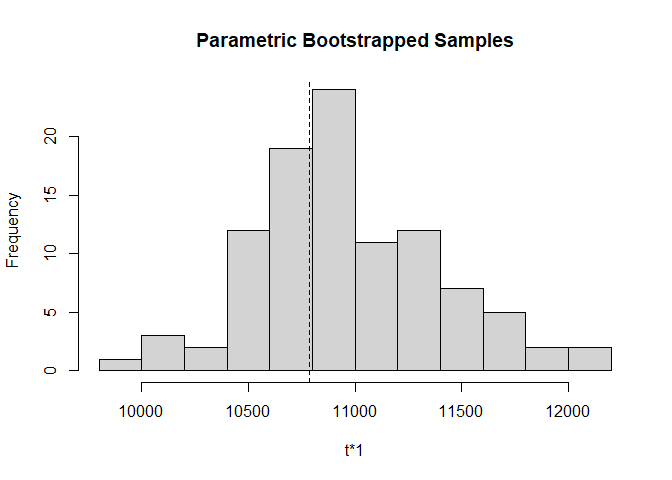<!-- -->

### Best estimate of which site are occupied

``` r
?ranef
```

    ## starting httpd help server ... done

``` r
ELKranef = ranef(top_fm)
str(ELKranef)
```

    ## Formal class 'unmarkedRanef' [package "unmarked"] with 1 slot
    ##   ..@ post: num [1:698, 1:2, 1] 0.934 0.935 0 0 0 ...
    ##   .. ..- attr(*, "dimnames")=List of 3
    ##   .. .. ..$ : NULL
    ##   .. .. ..$ : chr [1:2] "0" "1"
    ##   .. .. ..$ : NULL

``` r
hist(ELKranef@post)
```

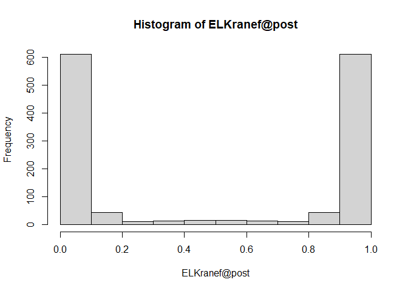<!-- -->

``` r
head(ELKranef@post)
```

    ## , , 1
    ## 
    ##              0          1
    ## [1,] 0.9336828 0.06631717
    ## [2,] 0.9345478 0.06545218
    ## [3,] 0.0000000 1.00000000
    ## [4,] 0.0000000 1.00000000
    ## [5,] 0.0000000 1.00000000
    ## [6,] 0.0000000 1.00000000

``` r
summary.y2=as.data.frame(t(apply(ydata7[,-1],1,na01.fnc)))
ELKoccu=cbind(data.frame(location=ydata7$location, easting=covar$easting, northing=covar$northing), summary.y2, data.frame(ELKpsi=ELKranef@post[,2,], ranefmode=bup(ELKranef , stat="mode"), ranefmean=bup(ELKranef , stat="mean")))
sum(ELKoccu$psinaive) # 250/698 = 
```

    ## [1] 250

``` r
sum(ELKoccu$ranefmode) # 255/698 = 
```

    ## [1] 262

``` r
sum(ELKoccu$ranefmean) # 276.6746/698 = 
```

    ## [1] 282.1166

``` r
Nocc(top_fm)
```

    ## [1] 282.1166

``` r
head(ELKoccu)
```

    ##                                 location easting northing n0 n1 nNA running  T
    ## 1         1a bvp fireside 593655 5669661  593655  5669661  5  0  21       5 26
    ## 2       1a bvp fireside-2 593661 5669691  593661  5669691  5  0  21       5 26
    ## 3   1a hillsdale altalink 581622 5676626  581622  5676626 16  4   6      20 26
    ## 4 1a hillsdale burn north 584926 5676065  584926  5676065 18  2   6      20 26
    ## 5 1a hillsdale burn south 584830 5675685  584830  5675685  2  8  16      10 26
    ## 6       1a hillsdale east 585153 5675213  585153  5675213  4  3  19       7 26
    ##      pnaive psinaive     ELKpsi ranefmode  ranefmean
    ## 1 0.0000000        0 0.06631717         0 0.06631717
    ## 2 0.0000000        0 0.06545218         0 0.06545218
    ## 3 0.2000000        1 1.00000000         1 1.00000000
    ## 4 0.1000000        1 1.00000000         1 1.00000000
    ## 5 0.8000000        1 1.00000000         1 1.00000000
    ## 6 0.4285714        1 1.00000000         1 1.00000000

Plot Naive Detections:

``` r
ggplot(ELKoccu, aes(easting, northing, colour =psinaive, size = psinaive)) + geom_point()
```

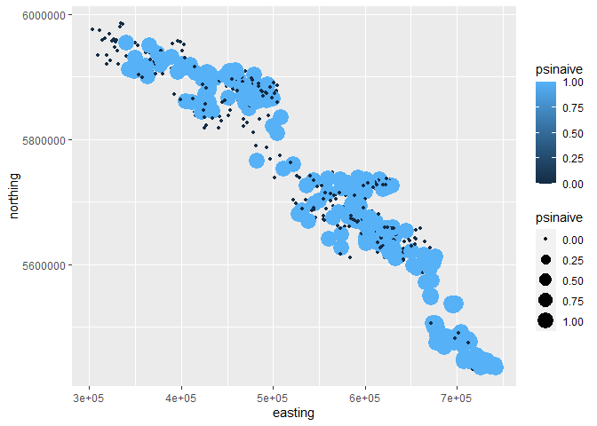<!-- -->

Plot Estimated Occupancy:

``` r
ggplot(ELKoccu, aes(easting, northing, colour =ELKpsi, size = ELKpsi)) + geom_point()
```

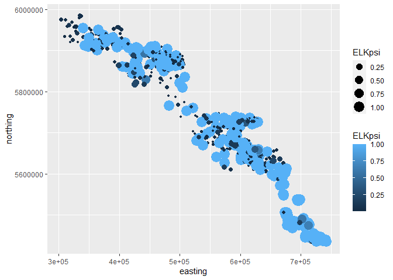<!-- -->

``` r
ggplot(ELKoccu, aes(easting, northing, colour =ELKpsi, size = as.factor(psinaive))) + geom_point()
```

    ## Warning: Using size for a discrete variable is not advised.

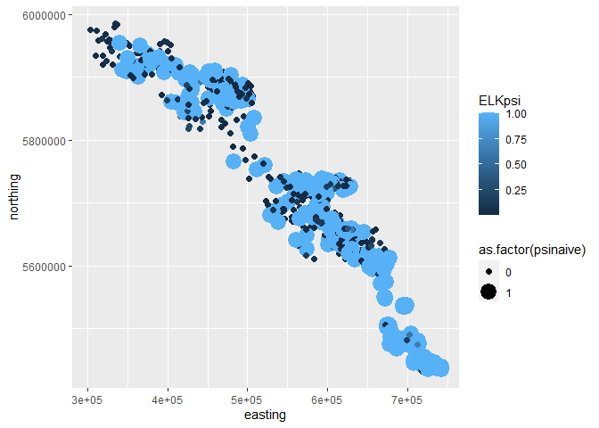<!-- -->

### Obtaining Confidence Interval on Estimated number of sites occupied

From Kery/Royle workshop 9…doc FINITE SAMPLE OCCUPANCY Nocc function now
in source.r

``` r
estimate.of.Nocc <- Nocc(top_fm)
estimate.of.Nocc #same as sum(ranefmean)
```

    ## [1] 282.1166

``` r
system.time(pb.N <- parboot(top_fm, Nocc, nsim=100, report=10))   
```

    ## t0 = 282.1166

    ## Running parametric bootstrap in parallel on 7 cores.

    ## Bootstrapped statistics not reported during parallel processing.

    ##    user  system elapsed 
    ##    0.95    0.36   95.04

``` r
# 100 Takes less  time (7min for 1000)
plot(pb.N)
abline(v=250, col="red")
```

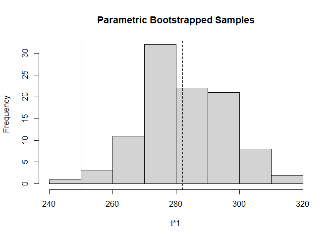<!-- -->

``` r
summary(pb.N@t.star) #again same as sum(ranefmean)
```

    ##       t*1       
    ##  Min.   :245.0  
    ##  1st Qu.:274.4  
    ##  Median :281.0  
    ##  Mean   :282.3  
    ##  3rd Qu.:292.3  
    ##  Max.   :316.6

``` r
quantile(pb.N@t.star, prob = c(0.025, 0.975)) #435.5439 494.5864
```

    ##     2.5%    97.5% 
    ## 256.5552 306.3504

### Prediction with Occupancy Model

``` r
summary(top_fm)
```

    ## 
    ## Call:
    ## occu(formula = ~protected3 + pplcat5 + tpi20 + camera + cc100 ~ 
    ##     elev + pplcat5 + NDVIJul20 + cuts500 + burns500 + slope, 
    ##     data = umf)
    ## 
    ## Occupancy (logit-scale):
    ##             Estimate     SE     z  P(>|z|)
    ## (Intercept)   -1.825 0.2342 -7.79 6.59e-15
    ## elev          -0.399 0.1374 -2.91 3.64e-03
    ## pplcat51       1.646 0.2939  5.60 2.13e-08
    ## pplcat510      2.036 0.3025  6.73 1.69e-11
    ## pplcat5100     2.063 0.3724  5.54 3.04e-08
    ## pplcat51000    0.918 0.7734  1.19 2.35e-01
    ## NDVIJul20      0.449 0.1394  3.22 1.29e-03
    ## cuts500       -0.786 0.1254 -6.27 3.66e-10
    ## burns500       0.159 0.0956  1.66 9.65e-02
    ## slope         -0.238 0.1084 -2.19 2.83e-02
    ## 
    ## Detection (logit-scale):
    ##                       Estimate     SE      z  P(>|z|)
    ## (Intercept)            -1.5892 0.1984 -8.011 1.14e-15
    ## protected3protected     0.6882 0.1713  4.017 5.90e-05
    ## protected3unprotected   0.8086 0.1748  4.626 3.73e-06
    ## pplcat51               -0.4598 0.1721 -2.671 7.56e-03
    ## pplcat510              -0.0295 0.1669 -0.177 8.60e-01
    ## pplcat5100             -0.5190 0.1838 -2.823 4.76e-03
    ## pplcat51000            -0.7941 0.4128 -1.924 5.43e-02
    ## tpi20                   0.1624 0.0408  3.982 6.84e-05
    ## cameraflash            -0.3687 0.1218 -3.027 2.47e-03
    ## cameraunknown          -0.4540 0.1111 -4.086 4.38e-05
    ## cc100                  -0.1971 0.0427 -4.611 4.00e-06
    ## 
    ## AIC: 5582.893 
    ## Number of sites: 698
    ## optim convergence code: 0
    ## optim iterations: 91 
    ## Bootstrap iterations: 0

Predict with averages (most 0 because scaled) must be more in fit simple
model for now

``` r
fm_temp=occu(~lure + camera ~elev, data=umf)
newData=data.frame("elev"=0, "lure"=1, "camera"="flash")
predict(fm_temp, type = 'state', newdata = newData)
```

    ##   Predicted         SE     lower     upper
    ## 1 0.4053037 0.02102027 0.3648578 0.4470772

## 3.0 Beyond Occupancy: Models of Counts

From [Mike Conroy
Workshop](https://sites.google.com/site/asrworkshop/home/schedule/r-occupancy-1).

We will illustrate the setup of an occupancy analysis with data for Blue
Grosbeaks (Guiraca caerulea) on 41 old fields planted to longleaf pines
(Pinus palustris) in southern Georgia, USA. Surveys were 500 m transects
across each field and were completed three times during the breeding
season in 2001. The data are located in a comma-delimited text file. The
first column (which is optional) is a label for each site, simple
numbered 1 - 41. The next 3 columns are the detection histories for each
site on each of 3 occasions during the 2001 breeding season. For now we
are going to ignore the covariates and other information in the
spreadsheet, and focus on the encounter histories for each site (columns
B, C, and D starting in row 3 and running to row 43 (41 sites total).

``` r
#rm(list=ls())
data<-read.csv("Data/blgr.csv")
head(data)
```

    ##   All.Fields Survey.1 Survey.2 Survey.3 Present.in.field Field.size
    ## 1          1        1        1        1                1       14.0
    ## 2          2        1        1        0                1       12.7
    ## 3          3        0        0        0                0       15.7
    ## 4          4        0        1        0                1       19.5
    ## 5          5        1        0        1                1       13.5
    ## 6          6        0        0        1                1        9.6
    ##   Log.field.size BQI.1.yes Crop.history Crop1 Crop.2 Count1 Count2 Count3
    ## 1      1.1461280         1         crop     1      0      1      2      2
    ## 2      1.1038037         1         crop     1      0      2      2      0
    ## 3      1.1958997         0        grass     0      1      0      0      0
    ## 4      1.2900346         0        grass     0      1      0      2      0
    ## 5      1.1303338         0         crop     1      0      1      0      1
    ## 6      0.9822712         0                 NA     NA      0      0      2

``` r
hist(data$Count1)
```

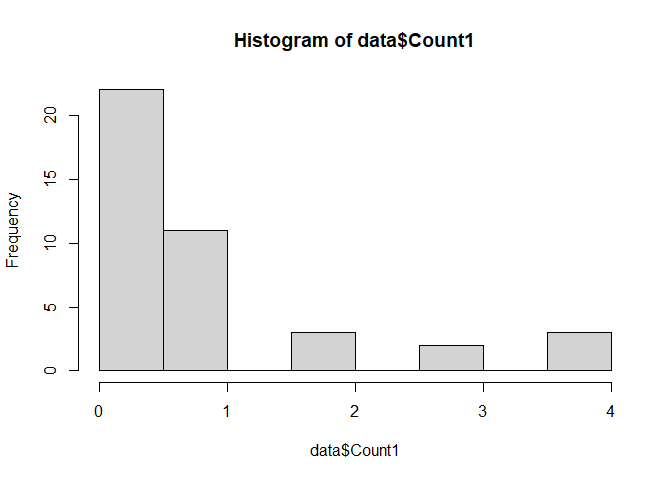<!-- -->

``` r
hist(data$Count2)
```

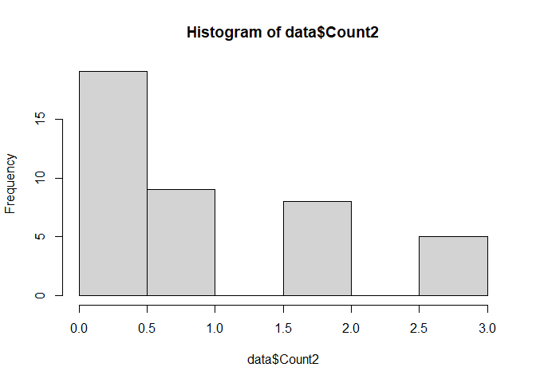<!-- -->

``` r
hist(data$Count3)
```

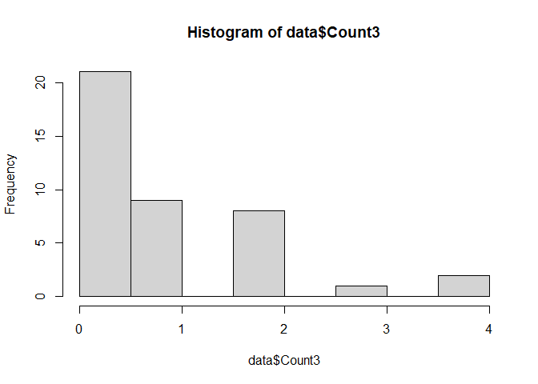<!-- -->

Detection data rows are sites columns are detection replicates, which
focus only on occupancy 1, 0 in the R-N model

``` r
y<-data[,2:4]
n<-nrow(data)
#site level (individual) covariates
blgr.site<-data[,5:9]
```

Create time factor and use as covariate. Observation level (time
specific) covariates:

``` r
time<-as.factor(rep(c(1,2,3),n))
blgr.obs<-data.frame(time)
```

Put everything together in unmarked data frame. Note that covariate can
come from separate files

``` r
blgr <- unmarkedFrameOccu(y = y, siteCovs = blgr.site,obsCovs=blgr.obs)
```

    ## Warning: siteCovs contains characters. Converting them to factors.

``` r
#summary of unmarked data frame
summary(blgr)
```

    ## unmarkedFrame Object
    ## 
    ## 41 sites
    ## Maximum number of observations per site: 3 
    ## Mean number of observations per site: 3 
    ## Sites with at least one detection: 33 
    ## 
    ## Tabulation of y observations:
    ##  0  1 
    ## 63 60 
    ## 
    ## Site-level covariates:
    ##  Present.in.field   Field.size    Log.field.size     BQI.1.yes     
    ##  Min.   :0.0000   Min.   : 6.40   Min.   :0.8062   Min.   :0.0000  
    ##  1st Qu.:1.0000   1st Qu.: 9.60   1st Qu.:0.9823   1st Qu.:0.0000  
    ##  Median :1.0000   Median :12.70   Median :1.1038   Median :0.0000  
    ##  Mean   :0.8049   Mean   :16.16   Mean   :1.1431   Mean   :0.3415  
    ##  3rd Qu.:1.0000   3rd Qu.:18.80   3rd Qu.:1.2742   3rd Qu.:1.0000  
    ##  Max.   :1.0000   Max.   :53.90   Max.   :1.7316   Max.   :1.0000  
    ##  Crop.history
    ##       : 5    
    ##  crop :28    
    ##  grass: 4    
    ##  mixed: 4    
    ##              
    ##              
    ## 
    ## Observation-level covariates:
    ##  time  
    ##  1:41  
    ##  2:41  
    ##  3:41

``` r
head(blgr)
```

    ## Data frame representation of unmarkedFrame object.
    ##    y.1 y.2 y.3 Present.in.field Field.size Log.field.size BQI.1.yes
    ## 1    1   1   1                1       14.0      1.1461280         1
    ## 2    1   1   0                1       12.7      1.1038037         1
    ## 3    0   0   0                0       15.7      1.1958997         0
    ## 4    0   1   0                1       19.5      1.2900346         0
    ## 5    1   0   1                1       13.5      1.1303338         0
    ## 6    0   0   1                1        9.6      0.9822712         0
    ## 7    0   0   1                1       44.0      1.6434527         1
    ## 8    1   1   1                1        9.4      0.9731279         1
    ## 9    1   1   0                1       19.6      1.2922561         0
    ## 10   1   1   1                1        7.0      0.8450980         0
    ##    Crop.history time.1 time.2 time.3
    ## 1          crop      1      2      3
    ## 2          crop      1      2      3
    ## 3         grass      1      2      3
    ## 4         grass      1      2      3
    ## 5          crop      1      2      3
    ## 6                    1      2      3
    ## 7          crop      1      2      3
    ## 8          crop      1      2      3
    ## 9                    1      2      3
    ## 10                   1      2      3

### CREATING MODELS

Royle-Nichols model with no covariates

J. A. Royle and J. D. Nichols. Estimating abundance from repeated
presence-absence data or point counts. Ecology, 84(3):777-790, 2003)

Fit the occupancy model of Royle and Nichols (2003), which relates
probability of detection of the species to the number of individuals
available for detection at each site. Probability of occupancy is a
derived parameter: the probability that at least one individual is
available for detection at the site.

``` r
?occuRN
rn1<-occuRN(~1 ~1,blgr, K=150)
summary(rn1)
```

    ## 
    ## Call:
    ## occuRN(formula = ~1 ~ 1, data = blgr, K = 150)
    ## 
    ## Abundance (log-scale):
    ##  Estimate    SE    z P(>|z|)
    ##      1.12 0.529 2.11  0.0349
    ## 
    ## Detection (logit-scale):
    ##  Estimate    SE    z P(>|z|)
    ##     -1.27 0.667 -1.9  0.0575
    ## 
    ## AIC: 170.9096 
    ## Number of sites: 41
    ## optim convergence code: 0
    ## optim iterations: 26 
    ## Bootstrap iterations: 0

Back transformations

``` r
backTransform(rn1,'det')
```

    ## Backtransformed linear combination(s) of Detection estimate(s)
    ## 
    ##  Estimate    SE LinComb (Intercept)
    ##      0.22 0.114   -1.27           1
    ## 
    ## Transformation: logistic

``` r
backTransform(rn1,"state")
```

    ## Backtransformed linear combination(s) of Abundance estimate(s)
    ## 
    ##  Estimate   SE LinComb (Intercept)
    ##      3.05 1.62    1.12           1
    ## 
    ## Transformation: exp

So the raw P is 0.22, the estimated N per site is 3.05, and there are 41
sites, or 125.05 blgr at each site.

### Empirical Bayes estimates of abundance at each site

``` r
re <- ranef(rn1)
```

    ## Warning in .local(object, ...): You did not specify K, the maximum value of N,
    ## so it was set to 50

``` r
plot(re)
```

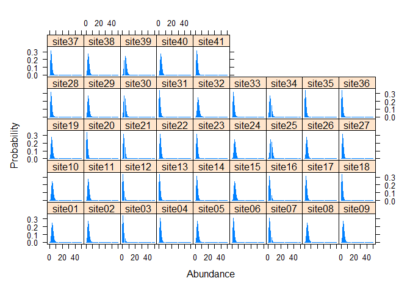<!-- -->

``` r
ebup <- bup(re, stat="mean")
rn1EBUP <- sum(ebup)
rn1_CI <- confint(re,level=0.95)
rn1_CI
```

    ##       2.5% 97.5%
    ##  [1,]    2     8
    ##  [2,]    1     7
    ##  [3,]    0     4
    ##  [4,]    1     6
    ##  [5,]    1     7
    ##  [6,]    1     6
    ##  [7,]    1     6
    ##  [8,]    2     8
    ##  [9,]    1     7
    ## [10,]    2     8
    ## [11,]    1     7
    ## [12,]    0     4
    ## [13,]    0     4
    ## [14,]    1     6
    ## [15,]    2     8
    ## [16,]    1     6
    ## [17,]    1     6
    ## [18,]    0     4
    ## [19,]    1     7
    ## [20,]    0     4
    ## [21,]    1     6
    ## [22,]    1     6
    ## [23,]    1     6
    ## [24,]    2     8
    ## [25,]    2     8
    ## [26,]    1     7
    ## [27,]    1     6
    ## [28,]    1     6
    ## [29,]    1     7
    ## [30,]    1     7
    ## [31,]    0     4
    ## [32,]    2     8
    ## [33,]    1     6
    ## [34,]    1     7
    ## [35,]    0     4
    ## [36,]    0     4
    ## [37,]    1     6
    ## [38,]    1     7
    ## [39,]    2     8
    ## [40,]    1     7
    ## [41,]    1     6

Create some more occupancy models

Time specific detection, constant occupancy:

``` r
#time specific detection, constant occupancy 
rn2<-occuRN(~time ~1,blgr)
backTransform(rn2,"state")
```

    ## Backtransformed linear combination(s) of Abundance estimate(s)
    ## 
    ##  Estimate   SE LinComb (Intercept)
    ##      2.99 1.54    1.09           1
    ## 
    ## Transformation: exp

Constant detection, abundance predicted by bqi:

``` r
rn3<-occuRN(~1 ~BQI.1.yes,blgr)
summary(rn3)
```

    ## 
    ## Call:
    ## occuRN(formula = ~1 ~ BQI.1.yes, data = blgr)
    ## 
    ## Abundance (log-scale):
    ##             Estimate   SE      z P(>|z|)
    ## (Intercept)    1.242 0.56  2.218  0.0266
    ## BQI.1.yes     -0.276 0.33 -0.836  0.4030
    ## 
    ## Detection (logit-scale):
    ##  Estimate    SE     z P(>|z|)
    ##     -1.31 0.685 -1.92  0.0554
    ## 
    ## AIC: 172.1869 
    ## Number of sites: 41
    ## optim convergence code: 0
    ## optim iterations: 32 
    ## Bootstrap iterations: 0

``` r
backTransform(linearComb(rn3, c(1, 0), type="state"))
```

    ## Backtransformed linear combination(s) of Abundance estimate(s)
    ## 
    ##  Estimate   SE LinComb (Intercept) BQI.1.yes
    ##      3.46 1.94    1.24           1         0
    ## 
    ## Transformation: exp

``` r
backTransform(linearComb(rn3, c(0, 1), type="state"))
```

    ## Backtransformed linear combination(s) of Abundance estimate(s)
    ## 
    ##  Estimate   SE LinComb (Intercept) BQI.1.yes
    ##     0.759 0.25  -0.276           0         1
    ## 
    ## Transformation: exp

``` r
predict(rn3, type ="state")
```

    ##    Predicted       SE     lower     upper
    ## 1   2.628899 1.548157 0.8288995  8.337695
    ## 2   2.628899 1.548157 0.8288995  8.337695
    ## 3   3.463377 1.939933 1.1553624 10.382006
    ## 4   3.463377 1.939933 1.1553624 10.382006
    ## 5   3.463377 1.939933 1.1553624 10.382006
    ## 6   3.463377 1.939933 1.1553624 10.382006
    ## 7   2.628899 1.548157 0.8288995  8.337695
    ## 8   2.628899 1.548157 0.8288995  8.337695
    ## 9   3.463377 1.939933 1.1553624 10.382006
    ## 10  3.463377 1.939933 1.1553624 10.382006
    ## 11  2.628899 1.548157 0.8288995  8.337695
    ## 12  2.628899 1.548157 0.8288995  8.337695
    ## 13  2.628899 1.548157 0.8288995  8.337695
    ## 14  2.628899 1.548157 0.8288995  8.337695
    ## 15  2.628899 1.548157 0.8288995  8.337695
    ## 16  2.628899 1.548157 0.8288995  8.337695
    ## 17  3.463377 1.939933 1.1553624 10.382006
    ## 18  3.463377 1.939933 1.1553624 10.382006
    ## 19  3.463377 1.939933 1.1553624 10.382006
    ## 20  3.463377 1.939933 1.1553624 10.382006
    ## 21  3.463377 1.939933 1.1553624 10.382006
    ## 22  3.463377 1.939933 1.1553624 10.382006
    ## 23  3.463377 1.939933 1.1553624 10.382006
    ## 24  3.463377 1.939933 1.1553624 10.382006
    ## 25  3.463377 1.939933 1.1553624 10.382006
    ## 26  3.463377 1.939933 1.1553624 10.382006
    ## 27  3.463377 1.939933 1.1553624 10.382006
    ## 28  2.628899 1.548157 0.8288995  8.337695
    ## 29  3.463377 1.939933 1.1553624 10.382006
    ## 30  3.463377 1.939933 1.1553624 10.382006
    ## 31  3.463377 1.939933 1.1553624 10.382006
    ## 32  3.463377 1.939933 1.1553624 10.382006
    ## 33  3.463377 1.939933 1.1553624 10.382006
    ## 34  3.463377 1.939933 1.1553624 10.382006
    ## 35  2.628899 1.548157 0.8288995  8.337695
    ## 36  2.628899 1.548157 0.8288995  8.337695
    ## 37  3.463377 1.939933 1.1553624 10.382006
    ## 38  3.463377 1.939933 1.1553624 10.382006
    ## 39  3.463377 1.939933 1.1553624 10.382006
    ## 40  3.463377 1.939933 1.1553624 10.382006
    ## 41  2.628899 1.548157 0.8288995  8.337695

Note the additive linear terms.

Detection as a function of time, abundance \~ Bq1:

``` r
rn4<-occuRN(~time ~BQI.1.yes,blgr)
summary(rn4)
```

    ## 
    ## Call:
    ## occuRN(formula = ~time ~ BQI.1.yes, data = blgr)
    ## 
    ## Abundance (log-scale):
    ##             Estimate    SE      z P(>|z|)
    ## (Intercept)    1.219 0.546  2.233  0.0255
    ## BQI.1.yes     -0.274 0.331 -0.829  0.4070
    ## 
    ## Detection (logit-scale):
    ##             Estimate    SE      z P(>|z|)
    ## (Intercept)   -1.460 0.689 -2.118  0.0342
    ## time2          0.364 0.381  0.954  0.3400
    ## time3          0.166 0.381  0.435  0.6634
    ## 
    ## AIC: 175.2559 
    ## Number of sites: 41
    ## optim convergence code: 0
    ## optim iterations: 25 
    ## Bootstrap iterations: 0

Detection as a function of time, abundance \~ Bq1 and Crop:

``` r
rn5 <-occuRN(~time ~BQI.1.yes + Crop.history, blgr)
summary(rn5)
```

    ## 
    ## Call:
    ## occuRN(formula = ~time ~ BQI.1.yes + Crop.history, data = blgr)
    ## 
    ## Abundance (log-scale):
    ##                   Estimate    SE      z P(>|z|)
    ## (Intercept)          1.604 0.686  2.338  0.0194
    ## BQI.1.yes           -0.201 0.353 -0.568  0.5698
    ## Crop.historycrop    -0.421 0.431 -0.976  0.3289
    ## Crop.historygrass   -0.591 0.648 -0.913  0.3612
    ## Crop.historymixed    0.112 0.567  0.197  0.8439
    ## 
    ## Detection (logit-scale):
    ##             Estimate    SE      z P(>|z|)
    ## (Intercept)   -1.577 0.734 -2.147  0.0318
    ## time2          0.376 0.378  0.994  0.3201
    ## time3          0.184 0.377  0.488  0.6254
    ## 
    ## AIC: 179.1477 
    ## Number of sites: 41
    ## optim convergence code: 0
    ## optim iterations: 39 
    ## Bootstrap iterations: 0

``` r
rn5AIC <-rn5@AIC
rn4AIC <- rn4@AIC
rn3AIC <- rn3@AIC
rn2AIC <- rn2@AIC
rn1AIC <- rn1@AIC
```

``` r
modelsAIC <- c(rn1AIC, rn2AIC, rn3AIC, rn4AIC, rn5AIC)
modelsAIC
```

    ## [1] 170.9096 173.9666 172.1869 175.2559 179.1477

The fact that `rn1` is the best is uninformative. Let’s do something
with model rn3

``` r
predict(rn3, type ="state")
```

    ##    Predicted       SE     lower     upper
    ## 1   2.628899 1.548157 0.8288995  8.337695
    ## 2   2.628899 1.548157 0.8288995  8.337695
    ## 3   3.463377 1.939933 1.1553624 10.382006
    ## 4   3.463377 1.939933 1.1553624 10.382006
    ## 5   3.463377 1.939933 1.1553624 10.382006
    ## 6   3.463377 1.939933 1.1553624 10.382006
    ## 7   2.628899 1.548157 0.8288995  8.337695
    ## 8   2.628899 1.548157 0.8288995  8.337695
    ## 9   3.463377 1.939933 1.1553624 10.382006
    ## 10  3.463377 1.939933 1.1553624 10.382006
    ## 11  2.628899 1.548157 0.8288995  8.337695
    ## 12  2.628899 1.548157 0.8288995  8.337695
    ## 13  2.628899 1.548157 0.8288995  8.337695
    ## 14  2.628899 1.548157 0.8288995  8.337695
    ## 15  2.628899 1.548157 0.8288995  8.337695
    ## 16  2.628899 1.548157 0.8288995  8.337695
    ## 17  3.463377 1.939933 1.1553624 10.382006
    ## 18  3.463377 1.939933 1.1553624 10.382006
    ## 19  3.463377 1.939933 1.1553624 10.382006
    ## 20  3.463377 1.939933 1.1553624 10.382006
    ## 21  3.463377 1.939933 1.1553624 10.382006
    ## 22  3.463377 1.939933 1.1553624 10.382006
    ## 23  3.463377 1.939933 1.1553624 10.382006
    ## 24  3.463377 1.939933 1.1553624 10.382006
    ## 25  3.463377 1.939933 1.1553624 10.382006
    ## 26  3.463377 1.939933 1.1553624 10.382006
    ## 27  3.463377 1.939933 1.1553624 10.382006
    ## 28  2.628899 1.548157 0.8288995  8.337695
    ## 29  3.463377 1.939933 1.1553624 10.382006
    ## 30  3.463377 1.939933 1.1553624 10.382006
    ## 31  3.463377 1.939933 1.1553624 10.382006
    ## 32  3.463377 1.939933 1.1553624 10.382006
    ## 33  3.463377 1.939933 1.1553624 10.382006
    ## 34  3.463377 1.939933 1.1553624 10.382006
    ## 35  2.628899 1.548157 0.8288995  8.337695
    ## 36  2.628899 1.548157 0.8288995  8.337695
    ## 37  3.463377 1.939933 1.1553624 10.382006
    ## 38  3.463377 1.939933 1.1553624 10.382006
    ## 39  3.463377 1.939933 1.1553624 10.382006
    ## 40  3.463377 1.939933 1.1553624 10.382006
    ## 41  2.628899 1.548157 0.8288995  8.337695

``` r
N_rn3 <- predict(rn3, type = "state")
str(N_rn3)
```

    ## 'data.frame':    41 obs. of  4 variables:
    ##  $ Predicted: num  2.63 2.63 3.46 3.46 3.46 ...
    ##  $ SE       : num  1.55 1.55 1.94 1.94 1.94 ...
    ##  $ lower    : num  0.829 0.829 1.155 1.155 1.155 ...
    ##  $ upper    : num  8.34 8.34 10.38 10.38 10.38 ...

``` r
hist(N_rn3$Predicted)
```

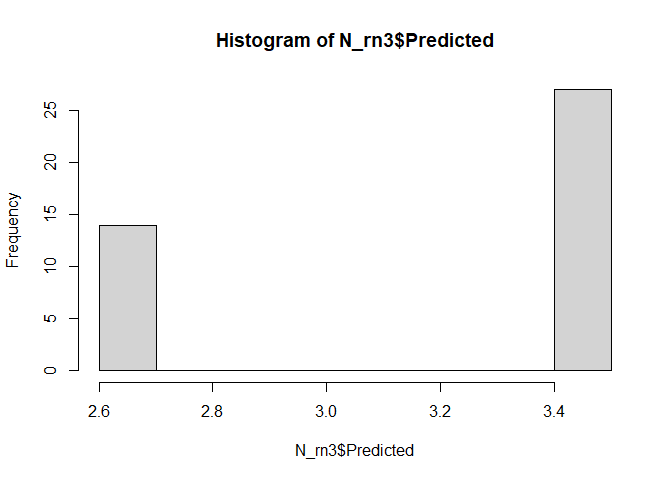<!-- -->

``` r
re5 <- ranef(rn5)
```

    ## Warning in .local(object, ...): You did not specify K, the maximum value of N,
    ## so it was set to 50

``` r
plot(re5)
```

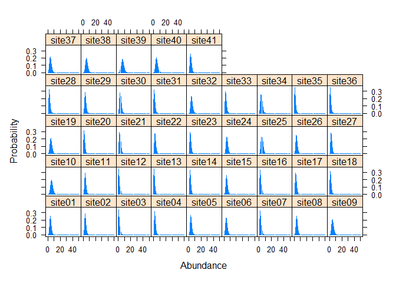<!-- -->

### COUNT MODELS N-Mixture Models, e.g., Point Counts

J. A Royle. N-mixture models for estimating population size from
spatially replicated counts. Biometrics , 60(1):108-115, 2004

``` r
data2<-read.csv("Data/blgr.csv")
head(data2)
```

    ##   All.Fields Survey.1 Survey.2 Survey.3 Present.in.field Field.size
    ## 1          1        1        1        1                1       14.0
    ## 2          2        1        1        0                1       12.7
    ## 3          3        0        0        0                0       15.7
    ## 4          4        0        1        0                1       19.5
    ## 5          5        1        0        1                1       13.5
    ## 6          6        0        0        1                1        9.6
    ##   Log.field.size BQI.1.yes Crop.history Crop1 Crop.2 Count1 Count2 Count3
    ## 1      1.1461280         1         crop     1      0      1      2      2
    ## 2      1.1038037         1         crop     1      0      2      2      0
    ## 3      1.1958997         0        grass     0      1      0      0      0
    ## 4      1.2900346         0        grass     0      1      0      2      0
    ## 5      1.1303338         0         crop     1      0      1      0      1
    ## 6      0.9822712         0                 NA     NA      0      0      2

Detection data rows are sites columns are detection replicates

``` r
counts<-data2[,10:12]
hist(counts$Count1)
```

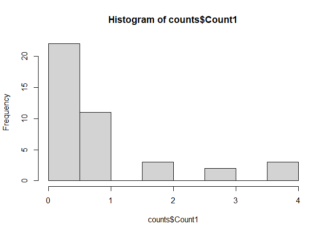<!-- -->

``` r
n<-nrow(data2)
```

Site level (individual) covariates:

``` r
blgr_count.site<-data2[,5:9]
```

Create time factor and use as covariate

Observation level (time specific) covariates:

``` r
time<-as.factor(rep(c(1,2,3),n))
blgr.obs<-data.frame(time)
```

Observation level (time specific) covariates:

``` r
blgr_count.obs<-data.frame(time)
```

Put everything together in unmarked data frame. Note that covariate can
come from separate files

``` r
blgr_count <- unmarkedFramePCount(y = counts, siteCovs = blgr_count.site,obsCovs=blgr_count.obs)
```

    ## Warning: siteCovs contains characters. Converting them to factors.

``` r
summary(blgr_count)
```

    ## unmarkedFrame Object
    ## 
    ## 41 sites
    ## Maximum number of observations per site: 3 
    ## Mean number of observations per site: 2.76 
    ## Sites with at least one detection: 36 
    ## 
    ## Tabulation of y observations:
    ##    0    1    2    3    4 <NA> 
    ##   62   43    3    2    3   10 
    ## 
    ## Site-level covariates:
    ##  Present.in.field   Field.size    Log.field.size     BQI.1.yes     
    ##  Min.   :0.0000   Min.   : 6.40   Min.   :0.8062   Min.   :0.0000  
    ##  1st Qu.:1.0000   1st Qu.: 9.60   1st Qu.:0.9823   1st Qu.:0.0000  
    ##  Median :1.0000   Median :12.70   Median :1.1038   Median :0.0000  
    ##  Mean   :0.8049   Mean   :16.16   Mean   :1.1431   Mean   :0.3415  
    ##  3rd Qu.:1.0000   3rd Qu.:18.80   3rd Qu.:1.2742   3rd Qu.:1.0000  
    ##  Max.   :1.0000   Max.   :53.90   Max.   :1.7316   Max.   :1.0000  
    ##  Crop.history
    ##       : 5    
    ##  crop :28    
    ##  grass: 4    
    ##  mixed: 4    
    ##              
    ##              
    ## 
    ## Observation-level covariates:
    ##  time  
    ##  1:41  
    ##  2:41  
    ##  3:41

### CREATING MODELS

Royle count model with no covariates

``` r
pc1<-pcount(~1 ~1,blgr_count, K = 500)
pc1
```

    ## 
    ## Call:
    ## pcount(formula = ~1 ~ 1, data = blgr_count, K = 500)
    ## 
    ## Abundance:
    ##  Estimate   SE   z  P(>|z|)
    ##         6 1.23 4.9 9.78e-07
    ## 
    ## Detection:
    ##  Estimate   SE     z  P(>|z|)
    ##     -6.52 1.23 -5.29 1.25e-07
    ## 
    ## AIC: 238.4754

``` r
backTransform(pc1,"state")
```

    ## Backtransformed linear combination(s) of Abundance estimate(s)
    ## 
    ##  Estimate  SE LinComb (Intercept)
    ##       404 495       6           1
    ## 
    ## Transformation: exp

``` r
backTransform(pc1,"det")
```

    ## Backtransformed linear combination(s) of Detection estimate(s)
    ## 
    ##  Estimate      SE LinComb (Intercept)
    ##   0.00147 0.00181   -6.52           1
    ## 
    ## Transformation: logistic

``` r
sum(counts$Count1)
```

    ## [1] 35

### Goodness of Fit test with AICcmodavg

``` r
Nmix.gof.test(pc1, nsim = 50, plot.hist = TRUE)
```

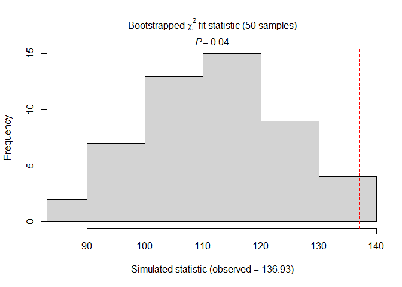<!-- -->

    ## 
    ## Chi-square goodness-of-fit for N-mixture model of 'unmarkedFitPCount' class
    ## 
    ## Observed chi-square statistic = 136.9278 
    ## Number of bootstrap samples = 50
    ## P-value = 0.04
    ## 
    ## Quantiles of bootstrapped statistics:
    ##   0%  25%  50%  75% 100% 
    ##   85  104  111  120  138 
    ## 
    ## Estimate of c-hat = 1.22

Time specific:

``` r
pc2<-pcount(~time ~1,blgr_count, K = 150)
backTransform(pc2,"state")
```

    ## Backtransformed linear combination(s) of Abundance estimate(s)
    ## 
    ##  Estimate   SE LinComb (Intercept)
    ##       105 87.3    4.66           1
    ## 
    ## Transformation: exp

``` r
Nmix.gof.test(pc2, nsim = 50, plot.hist = TRUE)
```

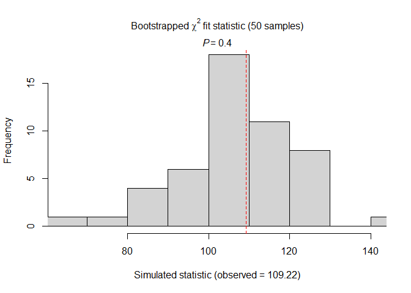<!-- -->

    ## 
    ## Chi-square goodness-of-fit for N-mixture model of 'unmarkedFitPCount' class
    ## 
    ## Observed chi-square statistic = 109.2178 
    ## Number of bootstrap samples = 50
    ## P-value = 0.4
    ## 
    ## Quantiles of bootstrapped statistics:
    ##   0%  25%  50%  75% 100% 
    ##   63  101  108  115  141 
    ## 
    ## Estimate of c-hat = 1.02

Complex models:

``` r
pc3<-pcount(~time ~ Field.size,blgr_count, K = 150)
pc4<-pcount(~time ~BQI.1.yes, blgr_count, K = 150)
pc5<-pcount(~time ~Crop.history, blgr_count, K = 150)
```

Model Selection:

``` r
pc5AIC <-pc5@AIC
pc4AIC <- pc4@AIC
pc3AIC <- pc3@AIC
pc2AIC <- pc2@AIC
pc1AIC <- pc1@AIC

modelsAIC <- c(pc1AIC, pc2AIC, pc3AIC, pc4AIC, pc5AIC)
pc5
```

    ## 
    ## Call:
    ## pcount(formula = ~time ~ Crop.history, data = blgr_count, K = 150)
    ## 
    ## Abundance:
    ##                   Estimate    SE     z  P(>|z|)
    ## (Intercept)          4.732 0.516  9.17 4.80e-20
    ## Crop.historycrop    -0.637 0.405 -1.57 1.15e-01
    ## Crop.historygrass   -1.011 0.588 -1.72 8.52e-02
    ## Crop.historymixed   -1.517 0.689 -2.20 2.78e-02
    ## 
    ## Detection:
    ##             Estimate    SE      z  P(>|z|)
    ## (Intercept)  -4.2268 0.681 -6.211 5.27e-10
    ## time2        -1.9585 0.536 -3.657 2.55e-04
    ## time3        -0.0333 0.271 -0.123 9.02e-01
    ## 
    ## AIC: 214.8876

Now need to do backtransformations for each of the 4 classes of the Crop
History Mixed

For the Intercept value:

``` r
backTransform(linearComb(pc5, coefficients = c(1, 0, 0, 0), type="state"))
```

    ## Backtransformed linear combination(s) of Abundance estimate(s)
    ## 
    ##  Estimate   SE LinComb (Intercept) Crop.historycrop Crop.historygrass
    ##       114 58.6    4.73           1                0                 0
    ##  Crop.historymixed
    ##                  0
    ## 
    ## Transformation: exp

Crop history = grass

``` r
backTransform(linearComb(pc5, coefficients = c(0, 0, 1, 0), type="state"))
```

    ## Backtransformed linear combination(s) of Abundance estimate(s)
    ## 
    ##  Estimate    SE LinComb (Intercept) Crop.historycrop Crop.historygrass
    ##     0.364 0.214   -1.01           0                0                 1
    ##  Crop.historymixed
    ##                  0
    ## 
    ## Transformation: exp

Prediction:

``` r
NmixPred <- predict(pc5, type = "state")
hist(NmixPred$Predicted)
```

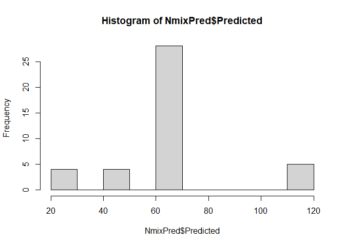<!-- -->

### Fitting Occupancy Model to ‘count’ data

``` r
blgr_occm1 <- occu(~time ~Crop.history, data = blgr)
blgr_occm1
```

    ## 
    ## Call:
    ## occu(formula = ~time ~ Crop.history, data = blgr)
    ## 
    ## Occupancy:
    ##                   Estimate   SE       z P(>|z|)
    ## (Intercept)          11.20  121  0.0926   0.926
    ## Crop.historycrop     -9.73  121 -0.0804   0.936
    ## Crop.historygrass    -9.73  121 -0.0804   0.936
    ## Crop.historymixed     4.28 1156  0.0037   0.997
    ## 
    ## Detection:
    ##             Estimate    SE     z P(>|z|)
    ## (Intercept)   0.0561 0.353 0.159   0.874
    ## time2         0.4685 0.487 0.961   0.336
    ## time3         0.2306 0.481 0.480   0.631
    ## 
    ## AIC: 178.3628

``` r
backTransform(linearComb(blgr_occm1, coefficients = c(1, 0, 0, 0),type="state"))
```

    ## Backtransformed linear combination(s) of Occupancy estimate(s)
    ## 
    ##  Estimate      SE LinComb (Intercept) Crop.historycrop Crop.historygrass
    ##         1 0.00165    11.2           1                0                 0
    ##  Crop.historymixed
    ##                  0
    ## 
    ## Transformation: logistic

``` r
blgrPsi <- predict(blgr_occm1, type="state")

## Bind
blgr_Pred <- rbind(NmixPred$Predicted, N_rn3$Predicted)
plot(NmixPred$Predicted ~N_rn3$Predicted)
```

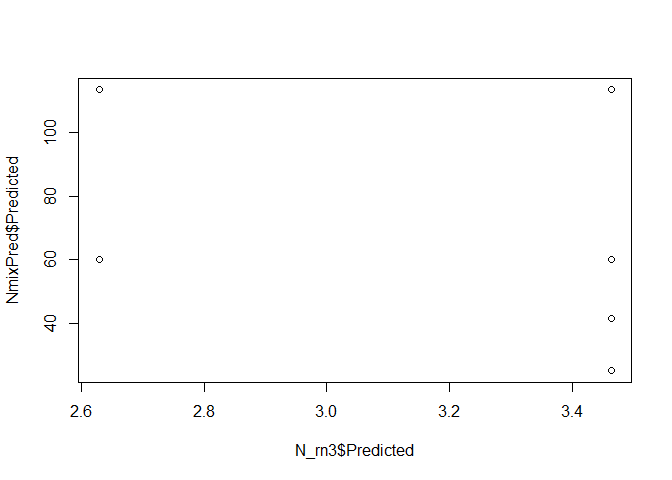<!-- -->
